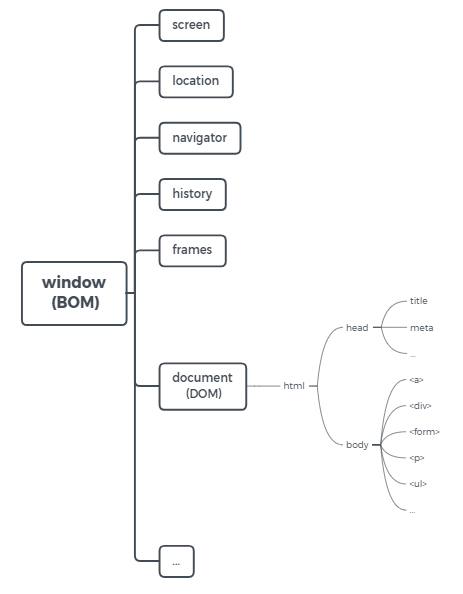
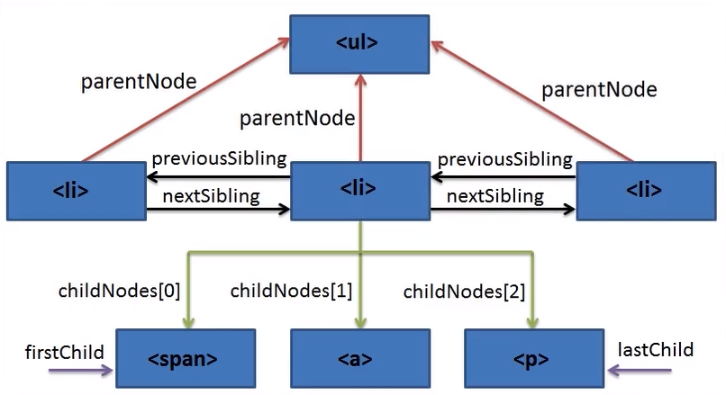

# DOM & BOM


### Basic knowledge

* Document Object Model and Browser Object Model;
* They are [Web APIs](<https://developer.mozilla.org/en-US/docs/Learn/JavaScript/Client-side_web_APIs/Introduction>), the interfaces to interact with external, like an electric socket;
* BOM = window, DOM = window.document, so, ==> **DOM is a child object of BOM;**




### Accessing DOM elements

* `document.getElementById()` vs. `document.querySelector()`: 尽量用后者，适用范围更广；

* `document.querySelectorAll()`: 不带 All 的 query 只选中第一个命中的，带 All 则返回所有符合条件的；

  ```js
  // Access a single element:
  
  document.getElementById('logo');
  document.querySelector('#logo');
  document.querySelector('.chore');
  
  // Access multiple elements: 
  
  // 注意 getElements... 是复数，返回的是 array-like 集合 html collection；
  document.getElementsByClassName('chore'); 	// returns html collection
  document.getElementsByTagName('li'); 	// returns html collection
  
  // another way do this:
  document.querySelectorAll('li')	// returns a NodeList
  document.querySelectorAll('li, .chores, #logo')	// 可以用多个条件选中不同类型的元素，返回到同一个nodeList中，此方法很灵活，尽量用这种
  ```

  

### Node vs. Element

* Everything in Document is Node

* **Element** is a specific type of **Node**
* 如 `<p> paragrah </p>` 这个**元素**由 p 标签（标签**节点**）和 内容 “paragraph” （文本**节点**）组成；


### Adding, removing and toggling CSS classes with JavaScript

* 通过元素的 el.classList 属性的 .add("classsName") / .remove() / .toggle() 实现；

* 早先学到这个知识点的时候，没有意识到有 toggle() 这个方法，而是自己写函数判断：

  ```js
  // 示例伪代码：
  function toggle(el, cls) {
      if (el has cls) {
          el.remove(cls)
      } else {
          el.add(cls)
      }
  }	
  
  // JS 原生代码；jQuery 有 hasClass()方法
  
  btnEl[3].onclick = function () {
      if (String(paraEl.getAttribute('class')).includes('enlarge-font')) {
          paraEl.classList.remove('enlarge-font');
      } else {
          paraEl.classList.add('enlarge-font');
      }
  }
  
  // stackOverflow 上看到有 el.className 属性可以用，但我自己没有试出来
  ```

  

### null vs. undefined

**undefined**: a variable has been declared but not been defined, namely not been assigned a value.

**null**: assigned a specific non-exist value, *null*, to a variable, which later on will make it avoid from a lot of errors; if we just leave it *undefined*, it will have more chances to catch errors. In many cases, null is safer than undefined.

我的理解：把不确定的 undefined 指定为确定的 null，限定变量的值，减少意外情况。

 

### Changing JavaScript Attributes

* **Get attribute**: `bodyEl.getAttribute('onload');`  attribute can be"onload", "id", etc. 

* **Set attribute**: `bodyEl.setAttribute('id', 'gsr, newgsr, alsogsr');` 会覆盖现有的属性，若是添加、要把现有的属性也写上去；
* Another way to change CSS classes [ *vs. elm.classList* ]: 
  * `el.setAttribute('class', 'newClassName, anotherClassName');`
* **Remove attribute**: `elm.removeAttribute('class');`


### DOM Traversals (theory)

* Traversal: walking / moving across, through, over something | 遍历

* 应用场景：某些节点并不是实时存在、而是按需动态生成的，通常没法用固定的名称引用它（因为某些时刻它不存在）、需要用这些比较灵活的相对引用方法来对其进行设定和操作；




---


#### parentNode vs. parentElement

[stackOverflow](<https://stackoverflow.com/questions/8685739/difference-between-dom-parentnode-and-parentelement>)

`parentElement` is new to Firefox 9 and to DOM4, but it has been present in all other major browsers for ages.

In most cases, it is the same as `parentNode`. The only difference comes when a node's `parentNode`is not an element. If so, `parentElement` is `null`.

As an example:

```js
document.body.parentNode; // the <html> element
document.body.parentElement; // the <html> element

document.documentElement.parentNode; // the document node
document.documentElement.parentElement; // null

(document.documentElement.parentNode === document);  // true
(document.documentElement.parentElement === document);  // false
```

Since the **`<html>` element (`document.documentElement`)** doesn't have a parent that is an element, `parentElement` is `null`. (There are other, more unlikely, cases where `parentElement` could be `null`, but you'll probably never come across them.)


> `document.documentElement` 指向 `<html>` 标签；

> Always use `parentNode` when possible.


#### childNodes vs. children

* 用 `childNodes` 会把 html 文档中 换行、空格 也列到 nodeList 中，如下的 text 节点；影响准确获取 element nodes；

```
NodeList(9) [text, li.todo__item, text, li.todo__item, text, li.todo__item, text, li.todo__item, text]
0: text
1: li.todo__item
2: text
3: li.todo__item
4: text
5: li.todo__item
6: text
7: li.todo__item
8: text
length: 9
__proto__: NodeList
```

* 用 `children` 就只获取 element nodes (HTML Collection)、忽略 text nodes：

```
HTMLCollection(4) [li.todo__item, li.todo__item, li.todo__item, li.todo__item]
0: li.todo__item
1: li.todo__item
2: li.todo__item
3: li.todo__item
length: 4
__proto__: HTMLCollection
```


> 尽量用 `elm.children`，除非要获取所有包括非元素类型的子节点


* 获取子节点的 `firstChild`、`lastChild` 有着与 `childNodes` 一样的情况，包含了不必要的 text nodes，要准确获取元素类型的子节点 (child element nodes)，用 `firstElementChild` 和 `lastElementChild` 代替；

* 获取隔壁节点的`previousSibling`、`nextSibling` 同样情况，会有多余的 text nodes 干扰，要获取隔壁元素节点用 `previousElementSibling`、`nextElementSibling` 代替；

  

#### Node Types - from [MDN](<https://developer.mozilla.org/en-US/docs/Web/API/Node/nodeType>)

##### Node type constants

| Constant                           | Value | Description                                                  |
| :--------------------------------- | :---- | :----------------------------------------------------------- |
| `Node.ELEMENT_NODE`                | `1`   | An [`Element`](https://developer.mozilla.org/en-US/docs/Web/API/Element) node like `<p>` or `<div>` |
| `Node.TEXT_NODE`                   | `3`   | The actual [`Text`](https://developer.mozilla.org/en-US/docs/Web/API/Text) inside an [`Element`](https://developer.mozilla.org/en-US/docs/Web/API/Element) or [`Attr`](https://developer.mozilla.org/en-US/docs/Web/API/Attr). |
| `Node.CDATA_SECTION_NODE`          | `4`   | A [`CDATASection`](https://developer.mozilla.org/en-US/docs/Web/API/CDATASection), such as `<!CDATA[[ … ]]>`. |
| `Node.PROCESSING_INSTRUCTION_NODE` | `7`   | A [`ProcessingInstruction`](https://developer.mozilla.org/en-US/docs/Web/API/ProcessingInstruction) of an XML document, such as `<?xml-stylesheet … ?>`. |
| `Node.COMMENT_NODE`                | `8`   | A [`Comment`](https://developer.mozilla.org/en-US/docs/Web/API/Comment) node, such as `<!-- … -->`. |
| `Node.DOCUMENT_NODE`               | `9`   | A [`Document`](https://developer.mozilla.org/en-US/docs/Web/API/Document) node. |
| `Node.DOCUMENT_TYPE_NODE`          | `10`  | A [`DocumentType`](https://developer.mozilla.org/en-US/docs/Web/API/DocumentType) node, such as `<!DOCTYPE html>`. |
| `Node.DOCUMENT_FRAGMENT_NODE`      | `11`  | A [`DocumentFragment`](https://developer.mozilla.org/en-US/docs/Web/API/DocumentFragment) node. |

##### Deprecated node type constants

The following constants have been deprecated and should not be used anymore.

| Constant                     | Value | Description                                                  |
| ---------------------------- | ----- | ------------------------------------------------------------ |
| `Node.ATTRIBUTE_NODE`        | 2     | An [`Attribute`](https://developer.mozilla.org/en-US/docs/Web/API/Attr) of an [`Element`](https://developer.mozilla.org/en-US/docs/Web/API/Element). Attributes no longer implement the [`Node`](https://developer.mozilla.org/en-US/docs/Web/API/Node) interface as of [DOM4](https://www.w3.org/TR/dom/). |
| `Node.ENTITY_REFERENCE_NODE` | 5     | An XML Entity Reference node, such as `&foo;`. Removed in [DOM4](https://www.w3.org/TR/dom/). |
| `Node.ENTITY_NODE`           | 6     | An XML `<!ENTITY …>` node. Removed in [DOM4](https://www.w3.org/TR/dom/). |
| `Node.NOTATION_NODE`         | 12    | An XML `<!NOTATION …>` node. Removed in [DOM4](https://www.w3.org/TR/dom/). |


### Intro to JavaScript Events

* oninput	// 之前没留意有这个事件

* removeEventListener    // 以前的浏览器，在删除元素之前，需要 detach any events bound to it，因此需要这个方法，现代浏览器已经不需要了；


