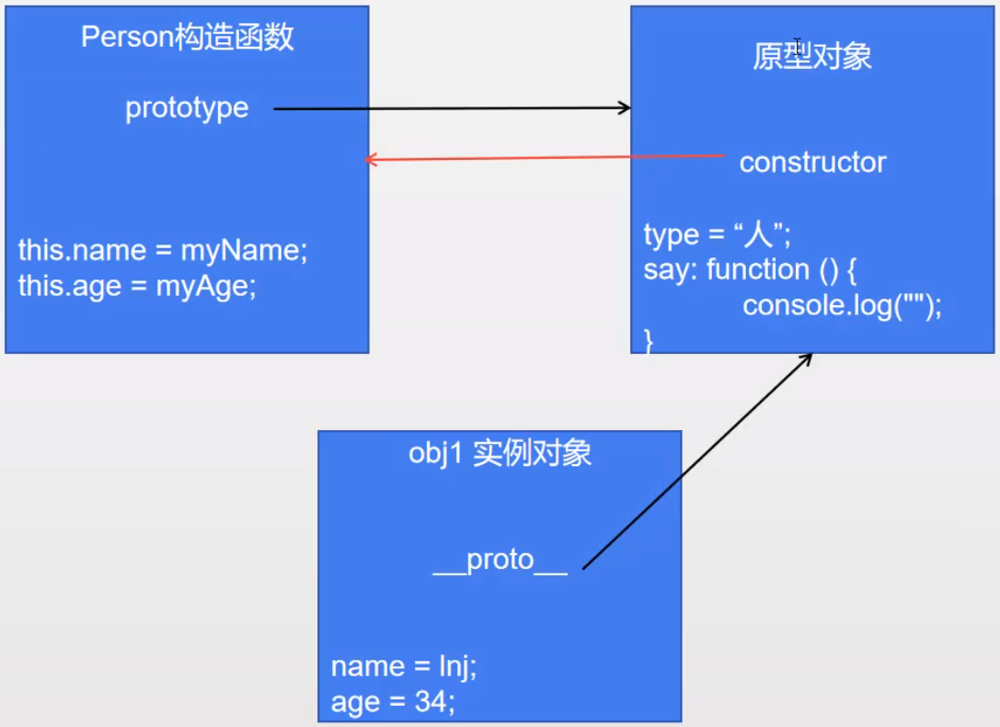
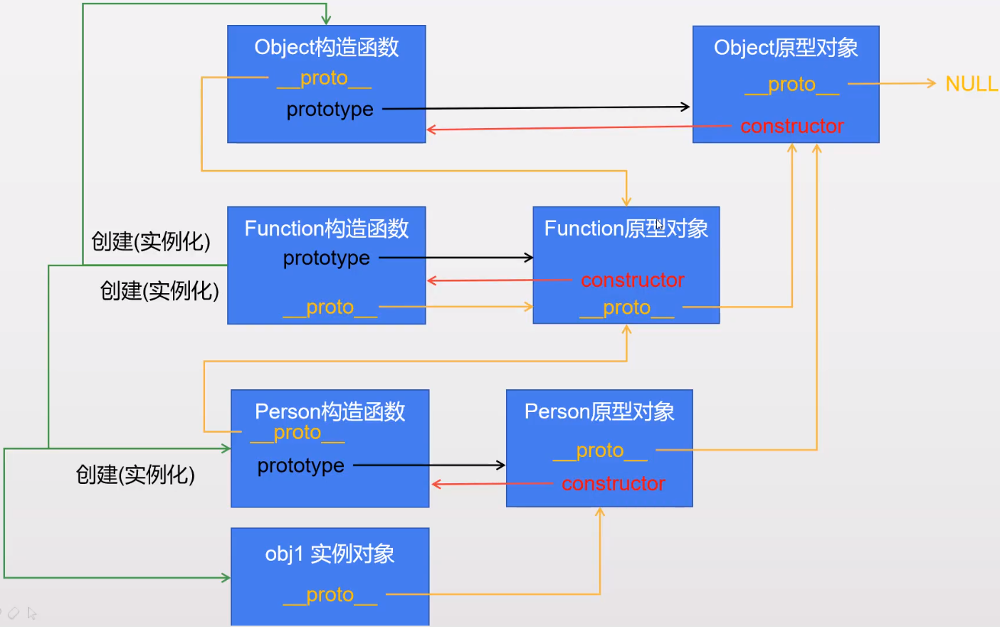

# JavaScript Object-oriented Programming


#### 创建对象的三种方式

一、通过创建 Object 实例

```js
let obj = new Object();
obj.name = 'John Doe';
obj.age = 19;
obj.greet = function () {
    console.log('Hello');
}
console.log(obj.name);
console.log(age);
obj.say();
```

二、通过创建空对象

```js
let obj = {} // 创建空对象，等价于： let obj = new Object();
/*
其余代码与方式一雷同
*/
```

三、通过对象字面量

```js
let obj = {
    name: 'John Doe',
    age: 19,
    say: function () {
        console.log('Hello')
    } 
}
```


#### 基本概念

* 函数 vs. 方法
  * 函数：未与其它类显式绑定，可以直接调用
  * 方法：与其它类显式绑定，只能通过对象来调用

* `this` ：谁调用、就指向谁

  ```js
  function demo () {console.log(this)}
  demo(); // 输出 window 对象，该调用等价于 window.demo()，调用对象是 window，this 指向它
  
  let obj = {say: function () {console.log(this)}}
  obj.say(); // 输出 obj 对象，调用该方法的对象是 obj，因此 this 指向 obj；
  ```

  

* 工厂函数：专门用于创建对象的函数

  ```js
  function createPerson (pName, pAge) {
      let person = new Object();
      person.name = pName;
      person.age = pAge;
      person.say = function () {
          console.log('Hello')
      }
      return person;
  }
  let person1 = createPerson('Lisa', 18);
  console.log('person1'); // an object with specified name and age
  ```

  

* 构造函数：同样是专门用于创建对象的函数，本质上是工厂函数的简写

  * 首字母须大写
  * 只能通过 `new` 调用

  ```js
  function Person (pName, pAge) {
      // 不需要工厂函数的 new 创建新对象
      this.name = pName;
      this.age = pAge;
      this.say = function () {
          console.log('Hello');
      }
      // 不需要工厂函数的 return 新建的对象
  }
  let person1 = new Person('Thanos', 10000); // 注意需要通过 new 创建，工厂函数就不用 new
  console.log(person1); // same result as factory function
  ```

  * 运行构造函数 `new Person()` 后，系统做了什么事情？

    ```js
    function Person (pName, pAge) {
        // let obj = new Object(); // 系统自动创建一个新对象
        // let this = obj; // 系统自动将新对象赋值给 this
        this.name = pName;
        this.age = pAge;
        this.say = function () {
            console.log('Hello');
        }
        // return this; // 系统自动添加 返回上面自动创建的新对象
    }
    ```

    **可以看出，构造函数经过系统解析、自动添加语句之后，本质上就与工厂函数一样了。**

  

  * 公共方法的优化（把公共方法写在原型对象下面）

    * 对象中相同功能的方法若直接写在构造函数中，之后每创建一个实例就会开辟一块内存空间用于存放相同功能的方法，造成资源浪费；可以把公共方法写在原型对象中，如此，实例只会引用原型对象中的方法（内存中存放在同一地址的那个方法），不会重复创建；

    ```js
    function Person (pName, pAge) {
        this.name = pName;
        this.age = pAge;
    }
    Person.prototype = {
        constructor: Person,	// 需要申明 Person.prototype.constructor 为 Peron，否则将 Person.prototype 指向自定义的字面量对象之后，因自定义对象的 constructor 属性均指向 Object 构造函数，所以此时 Person 的 prototype 的 constructor 属性也会指向 Object，破坏了它的正常的原型链；
        
    // so, 只要自定义了 prototype 的任何属性或方法，都需要重新申明 contructor 为其构造函数
        
        say: function () {
            console.log('Hello')
        }
    }
    let p1 = new Person('Tom', 3);
    let p2 = new Person('Andy', 9);
    
    p1.say(); // Person 构造函数并没有 say() 方法，自动引用 Person 原型对象中的 say() 方法
    p2.say(); // 引用构造函数的原型对象中的同一个 say() 方法，与 p1.say() 引用的是同一个方法
    ```

  

* 原型对象 prototype

  * **prototype** 的特点

    * prototype 可存储公共方法与属性；
    * prototype 中的方法和属性可以让其构造函数创建的对象实例所共享；
    * prototype 中的方法和属性会被构造函数中的同名属性和方法所覆盖；

  * **prototype** 应用场景

    * 存储所有对象都相同的属性和方法；若是对象特有的属性方法，则存储在构造函数中；

    

  * JavaScript 对象的 **三角恋关系**

    * ”构造函数“ 中都有个默认属性 ”prototype“，该属性保存了一个对象，称为 ”原型对象“；
    * “原型对象” 中都有个默认属性 “constructor”，指向该原型对象所对应的 “构造函数”；
    * 通过 “构造函数” 所创建出来的对象称为 “实例对象”，每个 “实例对象” 都有个默认属性 “\__proto__” ，指向创建该 “实例对象” 的 “构造函数” 的 “原型对象”，即上述的 “prototype”；




* 原型链 prototype chain
  * some facts
    * 所有函数都是对象；
    * 所有对象都是 Object 的实例；
    * Function 函数是所有函数的祖先函数；
    * 所有构造函数都有 prototype 属性，保存着 “原型对象”；
    * 所有原型对象都有 contructor 属性，指向其对应的构造函数；
    * 所有对象都有 \__proto__ 属性，指向其构造函数的原型对象；



 

* 对象属性的 get 和 set
  * 获取对象的属性时，若不存在，会往其原型链上去查找；
  * 设置对象的属性时，若不存在，则在该对象中新建此属性；即使该属性存在于其原型链上，也不会去设置原型链上的属性；


#### JS OOP 三大特性

* 封装：隐藏实现细节，仅对外公开接口；

  * 如下例，封装了私有属性（局部变量），使得外部无法直接访问，间接通过构造函数的内部方法去写入/读出私有属性的值，如此可以设置写入/读出的条件，避免用户设置构造函数的属性为非法值；

  ```js
  function Person() {
      this.pubAge = 20;	// 公开属性，外部可以引用实例对象来修改：p1.age = -3，无法避免非法值 
      this.pubName = 'Aaron';
      
      let privAge = 18; // 私有属性（在构造函数的局部作用域内），外部无法直接访问
      let privName = 'Billy'; 
      
      function setAge(age) { // 提供私有方法（构造函数内的方法），让外部可间接设置私有属性的值
          if (age >= 0) {	// 如此即可设置检查点，避免属性被设置为非法值
          	privAge = age;
          }
      }
      function getAge() { // 提供私有方法，让外部可以间接获取属性值
          return privAge;	
      }
  }
  ```

  ```js
  function Person() {
    this.name = 'John';
    let age = 18;
  }
  
  let p1 = new Person();
  
  console.log(p1.name); // John
  console.log(p1.age);  // undefined
  ```

  

  * 属性与方法的分类

    * 实例属性与实例方法：通过实例对象访问的属性和方法 包括**动态**添加的属性和方法（不是在构造函数中定义的，而是在实例对象创建之后再添加的）；

      ```js
      function Person() {
        this.name = 'John';
        let age = 18;
      }
      
      let p1 = new Person();
      
      console.log(p1.name); // John 动态属性
      console.log(p1.age);  // undefined
      
      p1.age = 20;
      console.log(p1.age);  // 20，动态添加的属性
      p1.getAge = function () { // 动态添加的方法
          return this.age;
      }
      ```

      

    * 静态属性与静态方法：通过构造函数调用的属性与方法；

      ```js
      function Person() {
        this.name = 'John';
        let age = 18;
      }
      
      Person.num = 666;	// 动态添加构造函数的属性与方法
      Person.run = function () {
          console.log('run');
      }
      console.log(Person.num);
      Person.run();
      ```

      

  * 

* 继承

* 多态

