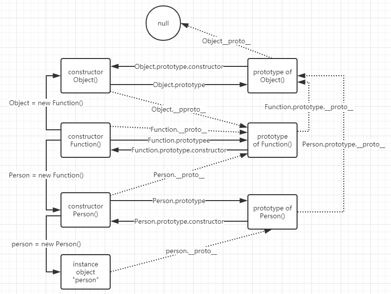

# JavaScript Object-oriented Programming


#### 创建对象的三种方式

一、通过创建 Object 实例

```js
let obj = new Object();
obj.name = 'John Doe';
obj.age = 19;
obj.greet = function () {
    console.log('Hello');
}
console.log(obj.name);
console.log(age);
obj.say();
```

二、通过创建空对象

```js
let obj = {} // 创建空对象，等价于： let obj = new Object();
/*
其余代码与方式一雷同
*/
```

三、通过对象字面量

```js
let obj = {
    name: 'John Doe',
    age: 19,
    say: function () {
        console.log('Hello')
    } 
}
```


#### 基本概念

* 函数 vs. 方法
  * 函数：未与其它类显式绑定，可以直接调用
  * 方法：与其它类显式绑定，只能通过对象来调用

* `this` ：谁调用、就指向谁

  ```js
  function demo () {console.log(this)}
  demo(); // 输出 window 对象，该调用等价于 window.demo()，调用对象是 window，this 指向它
  
  let obj = {say: function () {console.log(this)}}
  obj.say(); // 输出 obj 对象，调用该方法的对象是 obj，因此 this 指向 obj；
  ```

  

* 工厂函数：专门用于创建对象的函数

  ```js
  function createPerson (pName, pAge) {
      let person = new Object();
      person.name = pName;
      person.age = pAge;
      person.say = function () {
          console.log('Hello')
      }
      return person;
  }
  let person1 = createPerson('Lisa', 18);
  console.log('person1'); // an object with specified name and age
  ```

  

* 构造函数：同样是专门用于创建对象的函数，本质上是工厂函数的简写

  * 首字母须大写
  * 只能通过 `new` 调用

  ```js
  function Person (pName, pAge) {
  // 无需像工厂函数通过 new 创建新对象，JS 内部自动创建并关联 this 到 let per1 = new Object();
      this.name = pName;	// 对象名称改为用 this 来指代
      this.age = pAge;
      this.say = function () {
          console.log('Hello');
      }
      // 不需要工厂函数的 return 来向外部返回新建的对象，JS 内部自动实现返回对象：`return per1`
  }
  let person1 = new Person('Thanos', 10000); // 注意需要通过 new 创建，工厂函数就不用 new
  console.log(person1); // same result as factory function
  ```

  * 运行构造函数 `new Person()` 后，系统做了什么事情？

  ```js
  function Person (pName, pAge) {
      // let obj = new Object(); // 系统自动创建一个新对象
      // this = obj; // 系统自动将新对象赋值给 this
      this.name = pName;
      this.age = pAge;
      this.say = function () {
          console.log('Hello');
      }
      // return this; // 系统自动返回前面自动创建的新对象
  }
  ```

    **可以看出，构造函数经过系统解析之后，本质上就与工厂函数一样了。**

  

* 公共方法的优化（把公共方法写在原型对象下面）

  * 对象中相同功能的方法若直接写在构造函数中，之后每创建一个实例就会开辟一块内存空间用于存放相同功能的方法，造成资源浪费；
* 把公共方法写在原型对象中，如此，实例只会引用原型对象中的方法（内存中存放在同一地址的那个方法），不会重复创建，优化资源分配；
  
  ```js
  function Person (pName, pAge) {
      this.name = pName;
      this.age = pAge;
  }
  Person.prototype = {
      constructor: Person,	
      // 需要显式申明 Person.prototype.constructor 为 Peron，否则，将 Person.prototype 指向自定义字面量对象之后，因自定义对象的 constructor 属性默认均指向 Object 构造函数，使得 Person 的原型对象中的 constructor 属性也会指向 Object，破坏了它的原型链；因此只要自定义了 prototype 属性，都需要重新申明 Person.prototype.contructor 为其构造函数 Person；
      
      say: function () {
          console.log('Hello')
      }
  }
  let p1 = new Person('Tom', 3);
  let p2 = new Person('Andy', 9);
  
  p1.say(); // Person 构造函数并没有 say() 方法，自动引用 Person 原型对象中的 say() 方法；
  p2.say(); // 与 p1.say() 引用的是同一个方法
  ```
  
  
  
* 原型对象 prototype

  * **prototype** 的特点

    * prototype 可存储公共方法与属性；
    * prototype 中的方法和属性可以让其构造函数创建的对象实例所共享；
    * prototype 中的方法和属性会被构造函数中的同名属性和方法所覆盖；

  * **prototype** 应用场景

    * 存储所有实例对象都相同的属性和方法；若是对象特有的属性方法，则存储在构造函数中；

    

  * JavaScript 对象的 **三角恋关系**

    * ”构造函数“ 中都有个默认属性 ”prototype“，该属性保存了一个对象，称为 ”原型对象“；
    * “原型对象” 中都有个默认属性 “constructor”，指向该原型对象所对应的 “构造函数”；
    * 通过 “构造函数” 所创建出来的对象称为 “实例对象”，每个 “实例对象” 都有个默认属性 “\__proto__” ，指向创建该 “实例对象” 的 “构造函数” 的 “原型对象”，即上述的 “prototype”；

		 


> ## *JavaScript Object instance*
>
> *Instance Objects. An instance object is what is returned when instantiating a JavaScript  constructor function, using the JavaScript* **“new” keyword**. When you say “var bar = new Foo()”, “bar” becomes an “instance” of the function “Foo()”.


* 原型链 prototype chain
  * some facts
    * 所有函数都是对象，Any Function is an Object；
    * 所有对象都是 ***Object()*** 构造函数的实例；
    * Function() 构造函数是所有函数的祖先；
    * 所有构造函数都有 prototype 属性，保存着 “原型对象”；
    * 所有原型对象都包含 contructor 属性，指向其对应的构造函数；
    * 所有对象都有 \__proto__ 属性，指向其构造函数的原型对象；
    * 实例对象没有 prototype 属性；
    * 构造函数与原型对象拥有同名的属性与方法时，它的实例对象优先访问构造函数的属性与方法；
    
    

 

* 对象属性的 get 和 set
  * 获取对象的属性时，若不存在，会往其原型链上去查找，直至最上层，若未找到，返回 undefined；
  * 设置对象的属性时，若不存在，则在该对象中新建此属性；即使该属性存在于其原型链上，也不会去设置原型链上的属性；原型链上的同名属性会被覆盖；


#### JavaScript OOP 三大特性

* **封装**：隐藏实现细节，仅对外公开接口；

  * 如下例，封装了私有属性（局部变量），使得外部无法直接访问，间接通过构造函数的内部方法去写入/读出私有属性的值，如此可以设置写入/读出的条件，避免用户设置构造函数的属性为非法值；

  ```js
  function Person() {
      this.pubAge = 20;	// 公共属性，外部可以引用实例对象来修改：p1.age = -3，无法避免非法值 
      this.pubName = 'Aaron';
      
      let privAge = 18; // 私有属性（在构造函数的局部作用域内），外部无法直接访问
      let privName = 'Billy'; 
      
      function setAge(age) { // 提供私有方法（构造函数内的方法），让外部可间接设置私有属性的值
          if (age >= 0) {	// 如此即可设置检查点，避免属性被设置为非法值
          	privAge = age;
          }
      }
      function getAge() { // 提供私有方法，让外部可以间接获取属性值
          return privAge;	
      }
  }
  ```

  ```js
  function Person() {
    this.name = 'John';
    let age = 18;
  }
  
  let p1 = new Person();
  
  console.log(p1.name); // John  公有属性，外部可以访问到
  console.log(p1.age);  // undefined	私有属性，无法在外部访问
  ```

  

  **Constructor Function vs. Factory function**, from [stackOverflow](<https://stackoverflow.com/questions/8698726/constructor-function-vs-factory-functions>)

  > The basic difference is that a constructor function is used with the `new` keyword (which causes JavaScript to automatically create a new object, set `this` within the function to that object, and return the object):
  >
  > ```
  > var objFromConstructor = new ConstructorFunction();
  > ```
  >
  > A factory function is called like a "regular" function:
  >
  > ```
  > var objFromFactory = factoryFunction();
  > ```
  >
  > But for it to be considered a "factory" it would need to return a new instance of some object: you wouldn't call it a "factory" function if it just returned a boolean or something. This does not happen automatically like with `new`, but it does allow more flexibility for some cases.
  >
  > In a really simple example the functions referenced above might look something like this:
  >
  > ```
  > function ConstructorFunction() {
  >    this.someProp1 = "1";
  >    this.someProp2 = "2";
  > }
  > ConstructorFunction.prototype.someMethod = function() { /* whatever */ };
  > 
  > /* I wanted to point out that the examples for both the cases (constructor function vs factory function) should be consistent. The example for the factory function doesn't include someMethod for the objects returned by the factory, and that's where it gets a bit foggy. Inside the factory function, if one just does var obj = { ... , someMethod: function() {}, ... }, that would lead to each object returned hold a different copy of someMethod which is something that we might not want. That is where using new and prototype inside the factory function would help. */
  > 
  > function factoryFunction() {
  >    var obj = {
  >       someProp1 : "1",
  >       someProp2 : "2",
  >       someMethod: function() { /* whatever */ }
  >    };
  >    // other code to manipulate obj in some way here
  >    return obj;
  > }
  > ```
  >
  > Of course you can make factory functions much more complicated than that simple example.
  >
  > Some people prefer to use factory functions for everything just because they don't like having to remember to use `new` (EDIT: and this can be a problem because without `new` the function will still run but not as expected). I don't see that as an advantage: `new` is a core part of the language so to me deliberately avoiding it is a bit arbitrary - might as well avoid other keywords like `else`.
  >
  > One advantage to factory functions is when the object to be returned could be of several different types depending on some parameter.

  

  * #### 属性与方法的分类

      ```js
      function ConsFunc(x) {
          
          var privateVar = 'private var';  // 私有属性
          var privateMethod = function() { // 私有方法
              privateVar = "私有属性的值";   // 可通过私有方法 设置私有属性
              console.log(privateVar);
          }
          
          this.publicVar = x;	             // 公有属性
          this.publicMethod = function() { // 公有方法
              privateMethod();             // 通过公有方法 调用私有方法 设置私有属性
          }
      }
      
      ConsFunc.prototype.protoVar = 'a proto var';  // 原型属性
      ConsFunc.prototype.protoMethod = function() { // 原型方法
          console.log(this.protoVar);
      }; 
      
      ConsFunc.staticVar = 'this is a static var';  // 静态属性
      ConsFunc.staticMethod = function() {          // 静态方法
          console.log('this is a static method');
      };
      
      var instFunc = new ConsFunc('public var');    // 实例对象
      
      instFunc.instVar = 'an instance var';         // 静态属性or实例属性？
      instFunc.instMethod = function() {            // 静态方法or实例方法？
        console.log(instFunc.instVar);
      }
      
      
      console.log(instFunc.privateVar);// undefined
      instFunc.privateMethod();        // Uncaught TypeError: is not a function
      
      console.log(instFunc.publicVar); // public var
      instFunc.publicMethod();         // 私有属性的值
      
      console.log(instFunc.protoVar);  // this is a proto var
      instFunc.protoMethod();          // this is a proto var
      
      console.log(instFunc.staticVar); // undefined
      console.log(ConsFunc.staticVar); // this is a static var 
      instFunc.staticMethod();         // Uncaught TypeError: is not a function
      ConsFunc.staticMethod();         // this is a static method
      
      console.log(instFunc.instVar);   // an instance var
      instFunc.instMethod();           // an instance var
      ```
  
  

  * ##### Regarding properties and methods, below quotes from [stackOverflow](<https://stackoverflow.com/questions/1535631/static-variables-in-javascript>)

    > An example using a "classical" approach, with constructor functions maybe could help you to catch the concepts of basic OO JavaScript:
    >
    > ```
    > function MyClass () { // constructor function
    > 
    >   var privateVariable = "foo";  // Private variable // 用 var 定义的静态属性
    >   this.publicVariable = "bar";  // Public variable // 通过 this 设置公有属性
    > 
    >   this.privilegedMethod = function () { //Public Method//用this设置的公有/特权方法
    >     alert(privateVariable); // 公有/特权方法可以访问到私有属性
    >   };
    > }
    > 
    > // Instance method will be available to all instances but only load once in memory 
    > MyClass.prototype.publicMethod = function () { //实例/原型方法：放在原型对象下的方法 
    >   alert(this.publicVariable);
    > };
    > 
    > // Static variable shared by all instances
    > MyClass.staticProperty = "baz"; // 静态方法：用“Constructor.property”方式定义的方法
    > 
    > var myInstance = new MyClass();
    > ```
    >
    > `staticProperty` is defined in the MyClass object (which is a function) and has nothing to do with its created instances, JavaScript treats functions as [first-class objects](http://en.wikipedia.org/wiki/First-class_function), so being an object, you can assign properties to a function.

    

    

    

* **继承**

  * 如果构造函数A 与 构造函数B 的关系是：A is a B，就可以使用继承来优化代码、减少代码冗余；

  * 继承方式一：把原型对象改为父类的实例对象

    * 实际开发中并不常用，因为子类无法在传递形参给父类的构造函数；
    
    ```js
    function Person(name, age) {
        this.name = null;
        this.age = 0;
        this.say = function() {
            console.log(this.name, this.age)
        }
    }
    function Student(score) {	// 在这里没办法设置父类的形参 name, age，此方式的弊端
        this.score = 0;
        this.study = function() {
            console.log('good good study')
        }
    }
    
    Student.prototype = new Person();	// 把原型对象改为父类的实例对象即可实现继承（将另一个构造函数的属性和方法 委托给/挂载到 当前这个实例对象的 prototype 属性下面）

    Student.prototype.constructor = Student;	// 构造函数要指回自己，保证原型链正常
    
    let stu = new Student();
    console.log(stu.name, stu.age, stu.say(), stu.score, stu.study());
    ```
    
  * 三个函数调用相关的方法：bind, call, apply

    * 作用：都是用于修改函数或方法中的 this 的；

    * bind：修改函数的this为指定的对象，返回修改后的函数，可在this对象之后带上要传递的参数；

    * call：修改函数的this为指定的对象并立即执行修改后的函数，可在 this 对象后直接传入参数；

    * apply：修改函数的this为指定的对象并立即执行修改后的函数，可以在this后通过数组传入参数；

      ```js
      function test(a, b) {
          console.log(this, a, b);
      }
      test(11, 22); // 默认情况下，该函数 this 指向 window
      
      let obj = {name:'new obj'};
      
      // 将 test() 函数绑定到 obj 上，返回修改后的函数，可传入参数；
      let fn1 = test.bind(obj, 111, 222); 
      fn1(); // 调用对象变成了 obj;
      
      test.call(obj, 11, 22);	// 将 test() 的 this 改为 obj 并立即执行，同时可传入参数
      test.apply(obj,[11,22]);// 将 test() 的 this 改为 obj 并立即执行，通过数组传入参数
      ```

      

  * 继承的方式二：在当前构造函数中加上 `Parent_Constructor_Function.call(this, param1,...)`

    * 不足：父类的方法如果是动态挂在原型对象下面，子类就无法继承到，

      `Person.prototye.say = function () {console.log("Student子类无法继承这个方法")}`

    ```js
      function Person(name = 'John', age = 20) {
        // let per = new Object();  // 与工厂函数对应的语句，JS 自动添加
        // let this = per;          // 与工厂函数对应的语句，JS 自动添加
        // this = stu1;     // call 调用之后，当前 this 为 stu1
        this.name = name;	// call 调用之后，当前 this 为 stu1
        this.age = age;	
        this.say = function () {
          console.log('Hello!');
        }
      }
      
      function Student(myName, myAge, myScore = 100) {
        Person.call(this, myName, myAge); // 和方式一的重点区别！ 当前 this 为 stu1
        this.score = myScore;
        this.intro = function () {
          console.log('I am a student.');
        }
      }
      
    //  Student.prototype = new Person(); 		 // 方式一的方法
    //  Student.prototype.constructor = Student; // 方式一的方法
      
      let stu1 = new Student('Ray', 41, 98);
      
      console.log(`
        my name: ${stu1.name}, 
        my age: ${stu1.age}, 
        my score: ${stu1.score}, 
        `);
      stu1.say();
      stu1.intro();
    ```

    

  * 继承的方式三：`Student.prototype = Person.prototype;`

    * 优点：让子类可以同时继承到父类的**构造函数**和**原型对象**中的属性和方法；
    * 不足：Person 的构造函数变为 Student，父子的原型都是 Person.prototype，破坏了原型链关系，子类新增的方法、父类也可访问到，污染了父类的原型；

    ```js
    function Person(name = 'John', age = 20) {
        this.name = name;
        this.age = age;
    }
    Person.prototype.say = function () {  
        console.log('Hello');
    }  // 如果Student的原型没有指向Person原型，则Student就无法继承到这个动态设置的方法
    
    function Student(myName, myAge, myScore = 100) {
        Person.call(this, myName, myAge); // 当前 this 为 stu1
        this.score = myScore;
        this.intro = function () {
            console.log('I am a student.');
        }
    }
    
    Student.prototype = Person.prototype;  // 与方式二的重点区别！如此才能继承到动态加的方法
    Student.prototype.constructor = Student;
    
    /* 此方式的弊端：子类原型添加方法，父类亦可访问，污染了父类原型
    Student.prototype.run = function() {console.log('student runs')};
    let per1 = new Person();
    per1.run(); // student run
    */
    
    let stu1 = new Student('Ray', 41, 98);
    
    console.log(`
    my name: ${stu1.name}, 
    my age: ${stu1.age}, 
    my score: ${stu1.score}, 
    `);
    stu1.say();
    stu1.intro();
    ```

    

  * 继承的方式四（终极方案）：在方式三的基础上，把子类原型指向父类的实例对象；

    * 在子类的构造函数中通过 call 调用父类的构造函数，使得形参可以通过 call 传递到父类构造函数中；
    * 把子类的原型对象指向父类的一个实例对象，使得父类原型对象不被污染、原型链不被破坏；

    ```js
    <script>
      function Person(name = 'John', age = 20) {
        this.name = name;
        this.age = age;
      }
      Person.prototype.say = function () {
        console.log('Hello');
      }
      
      function Student(myName, myAge, myScore = 100) {
        Person.call(this, myName, myAge); 
        this.score = myScore;
        this.intro = function () {
          console.log('I am a student.');
        }
      }
      
    Student.prototype = new Person();    // <----  关键点：子类原型对象指向父类实例对象；
    Student.prototype.constructor = Student;
      
      let stu1 = new Student('Ray', 41, 98);
      
      console.log(`
        my name: ${stu1.name}, 
        my age: ${stu1.age}, 
        my score: ${stu1.score}, 
        `);
      stu1.say();
      stu1.intro();
      
    </script>
    ```

    

* 多态：指的是事物的多种状态，同一个事件发生在不同对象上会产生不同结果；

  * 如按下F1，在不同软件中有不同的效果；
  * 编程语言中的体现：父类变量保存了子类对象，保存的子类对象不同、产生结果也不同；
  * JS 是弱类型语言，默认就有多态的特性（传递不同类型的数据到同一个形参），不用特别关注多态；


* ##### ES6 的类和对象

  * Sample study 1:

  ```js
  class Person {
      constructor(myName, myAge) {	// 构造函数关键字
          this.name = myName; // 公有属性
          this.age = myAge;
      }
  
      _name = 'John'; // 实例属性
  	_age = 20;	
  	_say() {	// 实例方法，如下写法会添加到构造函数的原型对象中： Person.prototype._say()
      	console.log(this._name, this._age);
  	}
  
      static num = 666;	// 静态属性；部分浏览器不支持这种写法
  	static run = function() { // 静态方法，可以简写为 static run() {};
      	console.log('running');
  	}
  }
  
  let p1 = new Person('Joe', 22);
  console.log(p1);
  ```

  * Sample study 2:

  ```js
  class Person {
    constructor(myName, myAge) {
      this.name = myName;
      this.age = myAge;
      
      // ES6 标准写法：公有属性和方法要写在 contructor() 里面
      this._name = '公有属性';  
      this._age = 18;
      this._say = function() {
        console.log('公有方法', this._name, this._age);
      }
    }
    
    // 如下原型/实例属性的定义方法非 ES6 标准写法，部分浏览器不支持
    // 标准做法是在 constructor() 中添加
    
    /*
    _name = '实例属性';
    _age = 18;
    
    _say = function() {
      console.log('实例方法', this._name, this._age);
    }
    */
    
    // 如下静态属性的定义方法非 ES6 标准写法，部分浏览器不支持
    // static staticVar = '静态属性';
    // 标准写法是在 class clsName {} 之后以 clsName.staticVar = xx; 的方式定义
    
    // 如下为 ES6 定义静态方法的标准写法
    // static staticMethod = function () { // 可以简写如下：
    static staticMethod() { 
      console.log('静态方法');
    }
  }
  
  Person.staticVar = '静态属性';  // ES6 静态方法的标准写法
  ```

  * Sample study 3:     类的写法  pre-ES6 vs. ES6

  ```js
  // ES5 写法
  
  function Person(myName, myAge) {
    this.name = myName;	 // 公有属性
    this.age = myAge;
    this.hi = function() { // 公有方法
      console.log('Hi', this.name, this.age);
    }
  }
  
  Person.prototype.hello = function() { 		// 原型/实例 方法
    console.log('Hello', this.name, this.age);
  }
  
  Person.staticMethod = function() {
    console.log('static method: ', this.name, this.age);
  }
  
  let p1 = new Person('ES5', 20);
  console.log(p1); 		// Person {name: "ES6", age: 5, hi: ƒ}
  p1.hi(); 		 		// Hi,  ES6 5
  p1.hello(); 	 		// Hello,  ES6 5
  Person.staticMethod();  // static method:  Person undefined
  
  
  // ES6 写法
  class Person {
    constructor(myName, myAge) {
      this.name = myName;     // 公有属性
      this.age = myAge;
      this.hi = function () { // 公有方法
        console.log('Hi, ', this.name, this.age);
      }
    }
      
      hello() { 		// 原型/实例 方法
        console.log('Hello, ', this.name, this.age);
      }
      
      // static staticMethod = function() { 	// 静态方法 
      static Person.staticMethod() { 			// 简写形式
        console.log('static method: ', this.name, this.age);
      }
    }
  
  let p1 = new Person('ES6', 5);
  console.log(p1);  	  	 // Person {name: "ES6", age: 5, hi: ƒ}
  p1.hi(); 		  		 // Hi,  ES6 5
  p1.hello(); 	 		 // Hello,  ES6 5
  Person.staticMethod(); 	 // static method:  Person undefined
  ```

  * 用class定义类之后，就不能再用 `Student.prototype = {constructor = Student; ...}` 这种修改整个原型对象的方式来添加属性方法，而是要动态的添加，如：`Student.prototype.score = myScore; Student.prototype.sayHi = function() {}`，原因是 JS 要规避使用`class clsName {constructor(){}; method(){}}` 这种方式添加的原型/实例方法被冲掉；

  

* ##### ES6 继承

  ```js
  // Pre-ES6 Inheritance
  
  function Person(myName, myAge) {
    this.myName = myName; // JS 的某个原型上已经存在 name 属性，这里的参数/属性再用 name 会有冲突
    this.myAge = myAge;
  }
  
  Person.prototype.hi = function() {
    console.log('Hi Person, ', this.myName, this.myAge);
  }
  
  function Student(myName, myAge, myScore) {
    Person.apply(this, [myName, myAge]);
    this.myScore = myScore;
  }
  
  Student.prototype = new Person();
  Student.prototype.constructor = Student;
  Student.prototype.hello = function () {
    console.log('Hello Student, ', this.myName, this.myAge, this.myScore);
  }
  
  let stu = new Student('I am a student, ', 'I am 18 years old,', 'my score is 100.');
  console.log(stu);
  stu.hi();
  stu.hello();
  
  
  // ES6 Inheritance
  
  class Person {
    constructor(myName, myAge) {
      this.myName = myName;
      this.myAge = myAge;
    }
    hi() { 	// 相当于 hi = function () {}，写在这里的方法会放在原型对象中
      console.log('Hi from Person, ', this.myName, this.myAge);
    }
  }
  
  class Student extends Person {
    constructor(myName, myAge, myScore) {
      super(myName, myAge); 	// 相当于 Person.call(this, myName, myAge);
      this.myScore = myScore;
    }
    hello() {
      console.log('Hello from Student, ', this.myName, this.myAge, this.myScore);
    }
  }
  
  let stu = new Student('ES6', 5, 100);
  console.log(stu);
  stu.hi();
  stu.hello();
  ```

  

* 获取对象的真实类型

  ```js
  let arr = new Array();
  typeof arr; 		  // Object; typeof 只能用于检查简单类型的变量
  arr.constructor.name; // Array;	
  	// arr没有constructor属性，实际上是 arr.__proto__.constructor.name，
      // 即 Array() 构造函数的名字
  	// 这里出现了 .name 这个系统自带的属性，自定义的属性尽量避免用 .name 以免重名和覆盖
  ```

  

*  **instanceof** ：A instanceof B

  * 检查指定A 对象是否为 B 构造函数的实例
  * 只要 B 的原型对象出现在 A 的任一级原型链中，结果都为 true

  ```js
  class Person {
      constructor() {
        this._name = 'Joe';    
      }
  }
  let p1 = new Person();
  console.log(p1 instanceof Person);  // true
  ```

  

* **isPrototypeOf** ：A.prototype.isPrototypeOf(B)

  * 判断一个对象是否为另一个对象的原型
  * 只要 A 的原型对象出现在 B 的任一级原型链中，结果都为 true

  ```js
  class Person {
      name = 'Jon';
  }
  let p = new Person();
  console.log(Person.prototype.isPrototypeOf(p)); // true
  ```

* **in** 操作符：A in B

  * 判断 B 对象是否有 A 属性
  * B 对象的父类或原型中有 A 属性即为 true

  ```js
  class Person {
      name = null;
  	age = 0;
  }
  Person.prototype.height = 0;
  let p = new Person();
  console.log("name" in p);   // true
  console.log("height" in p); // true
  console.log(p.hasOwnerProperty('age'));     // true
  console.log(p.hasOwnerProperty('height'));  // false
  ```

  * **obj.hasOwnProperty(prop)** 只判断对象本身是否有此属性，不会到类或原型中查找


* 对象的增删改查【CRUD】

  ```js
  let p = {};
  
  // 增加 Create
  p.name1 = 'Joe';
  p["name2"] = 'Ali';
  
  // 修改 Update
  p.name1 = 'Simon';
  p.["name2"] = 'Thor';
  
  // 查询 Read
  console.log(p.name1);
  console.log(p["name2"]);
  
  // 删除 Delete
  delete p.name1;		// delete 关键字，之前没接触过
  delete p["name2"];
  ```

* 对象的遍历： `for (key in obj) {...}`

  ```js
  class Person {
      constructor(myName = 'default_ame', myAge = 0) {
          this.myName = myName;
          this.myAge = myAge;
          this.hello = function () {
              console.log('Hello');
          }
          hi() {
              console.log('Hi')
          }
      }    
  }
  let p = new Person('Bob', 20);
  for (let key in p) {
      console.log(key); // 键值对中的键：myName, myAge, hello (hi在原型对象中，不会遍历到)
      console.log(p[key]); // Bob, 20, hello(){...}
      console.log(p.key); // undefined，注意：属性值不能用点操作符、而是要用中括号才能获取
  }
  ```

* 对象解构赋值

  ```js
  // 大部分与数组解构赋值一样，除了 左边的变量名要和右边的键名 一样之外
  
  let obj = {name: 'Don', age: 18};
  let name = obj.name, age = obj.age; // 通常的赋值方法
  let {name, age} = obj; // 解构赋值的方法
  let {name, age} = {name: 'Don', age: 18}; // 等同于上一行
  let {age} = {name: 'Don', age: 18}; // 左边少了变量，就只赋值 age，名字一样即可，无所谓位置
  let {name, age, gender} = {name: 'Don', age: 18}; // 左边多出来的变量，为 undefined
  let {a, b} = {name: 'Don', age: 18}; // 变量名与键名不一样，会报错
  
  
  // 解构赋值的应用场景（简化参数传递）
  
  function sum([a, b]) {
      return a + b
  }
  let arr = [1, 2];
  sum(arr);
  
  function say({name, age}) {
      console.log(name, age);
  }
  let p = {name: 'Eva', 16};
  say(p);
  ```

  
  
  ###### 深拷贝 与 浅拷贝 (Deep Copy vs. Shallow Copy)

* 深拷贝：修改变量的值不会影响原有变量的值，默认情况下，基本数据类型都是深拷贝；

  ```js
  let num1 = 123;
  let num2 = num1;
  num2 = 666; // 并不影响 num1 的值
  ```

* 浅拷贝：修改变量的值会影响原有变量的值，默认情况下，引用类型都是浅拷贝；

  ```js
  class Person {
      _name = 'Fred';
  }
  let p1 = new Person();
  let p2 = p1;	// 浅拷贝：p2 在栈区的指针值等于 p1，指向同一块堆区（Heap）
  p2._name = 'George';	// 修改存储在堆区中的属性值
  console.log(p1._name);  // George
  console.log(p2._name);  // George
  ```

* 对象的深拷贝（只能深拷贝对象中的基本数据类型）

  ```js
  class Person {
      _name = 'Hill';
  	_age = 88;
  }
  let p1 = new Person();
  let p2 = new Object();
  
  // 深拷贝方式一：
  p2._name = p1._name;
  p2._age = p1._age;
  
  // 深拷贝方式二：
  for (let key in p1) {
      p2[key] = p1[key];
  }
  
  // 深拷贝方式三：(推荐)
  Object.assign(p2, p1)
  ```

* 完全深拷贝 

  * Real deep copy, to some extend. But it can be way more complicated: [How to deep clone in JavaScript](<https://stackoverflow.com/questions/4459928/how-to-deep-clone-in-javascript/>)

  ```js
  // Real Deep Copy - to some extend 
  // 以下代码无法实现对对象中的方法做深拷贝，拷贝到目标对象之后，方法变为匿名
  
  function deepCopy (tgt, src) {
    for (let k in src) {
      if (src[k] instanceof Object) {    // 是引用类型
        tgt[k] = new src[k].constructor; // 基于源对象的构造器，创建同类型空对象
        deepCopy(tgt[k], src[k]);        // 递归做子对象的深拷贝
      } else { 
        tgt[k] = src[k];                 // 是基本类型，直接赋值
      }
    }
  }
  let p2 = {};
  deepCopy(p2, p1);
  
  // or:
  
  function deepCopy(o) {
    let r = new o.constructor;  // 基于传入的对象的类型，创建同类型的空对象
    for (let k in o) {          // 遍历传入的对象
      if (o[k] instanceof Object) { // 如果当前属性也是一个对象
        r[k] = deepCopy(o[k]);      // 递归调用此函数，进入下一层做拷贝
      } else {
        r[k] = o[k];  // 如果当前属性是基本数据类型，直接赋值给拷贝目标对象相应的属性
      }
    }
    return r;
  }
  
  let p2 = deepCopy(p1);
  console.log(p2);
  ```


completed study on 4/23/2019