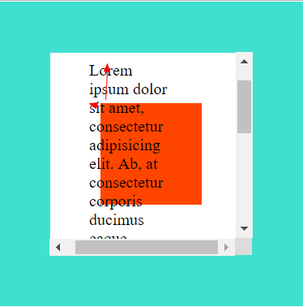

# 获取元素位置、大小的方法

### offset 相关属性

* ###### elm.offsetLeft & elm.offsetTop

  * 获取该元素到第一个开启了定位属性的祖先元素的偏移量；

  * 若祖先元素均未开启定位，则获取该元素到 body 的偏移量；
  * 区别于 elm.style.marginLeft/Top 获取的均为到 body 的偏移量；

* ###### elm.offsetParent

  * 获取该元素的第一个开启了定位属性的祖先元素 DOM 对象；
  * 若祖先元素均未开启定位属性，则获取到 body 对象；

```js
let parentDivEl = document.querySelector('.parent'),
    childDivEl = document.querySelector('.child');

childDivEl.onclick = function () {
    console.log(this.offsetLeft, this.offsetTop);
    // 父元素没有定位属性，输出 200 200
    // 父元素开启定位属性，输出 100 100
    console.log(this.offsetParent);
    // 父元素没有定位属性，输出 body DOM 对象
    // 父元素开启定位属性，输出 parentDiv 对象
}
```


### client 相关属性

* ###### clientWidth & clientHeight

  * 获取元素的 content + padding 的大小（offsetWidth/Height 还包括了 border）

    * clientWidth = contentW + paddingLR

    * offsetWidth = contentW + paddingLR + borderLR

      

* ###### clientLeft & clientTop

  * 获取元素 borderLeft 和 borderTop 的值

```js
let divEl = document.querySelector('.box');

console.log(divEl.clientWidth, divEl.clientHeight); // (200 200) = content + padding
console.log(divEl.clientLeft, divEl.clientTop); // (50 50) = borderLeft & borderTop
```


### scroll 相关属性

* ###### scrollWidth & scrollHeight

  * 当元素的内容没有超出元素的大小范围时，scrollW/H = **clientW/H** = content + padding；
  * 若内容超出元素的大小，scrollW/H = content + padding + **overflowW/H**；

* ###### scrollLeft & scrollTop

  * 元素内容滚动之后移出 content 与 padding 交界线的距离（元素开启 overflow: auto、出现滚动条）

    * 如下图，橘红色为 content、白色为 padding、蓝绿色为 border；
  * 元素的文本内容向上滚动了箭头长度的距离，起点为 content 和 padding 的交界线；
    * scrollTop = textContentTop - divContentTop

    
  