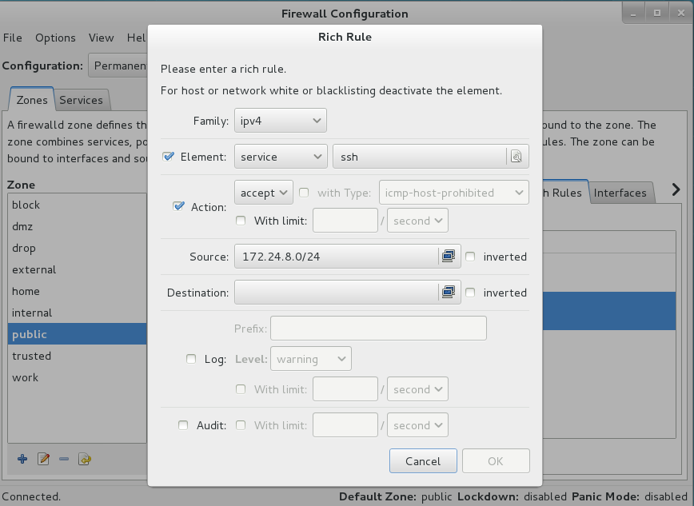

# RHCSA & RHCE

> root / redhat | rrhh9708
>
> grade / qq5156770


  **少部分考试环境没有安装 GUI，需要自行安装**：

​	`yum install -y xorg\* gnome\* glx\*` 


## 第1题

###### 重置系统密码：

* 修改系统的 root 帐号密码为 rrhh9708，确保能够使用 root 帐号能够登陆系统；

###### 根据以下信息完成虚拟机Desktop网络的修改：

* 主机名：desktop.group8.example.com

* IP地址：172.24.8.10

* 子网掩码：255.255.255.0

* 网关： 172.24.8.254

* 名称服务：172.24.8.254

  

---

###### 解题方法：

* 确定是否为 RHEL 7

  ```sh
  cat /etc/rehat-release
  Red Hat Enterprise Linux Server release 7.0 (Maipo)
  ```

* 重启 Linux，在引导界面 (grub) 按 `e` 进入编辑界面；

* 在中间 `linux16` 开头的这一行的末尾加上 `rd.break` 参数；

* 按 `ctrl + X` 运行修改过的内核程序；

* 约 30 秒后进入 emergency mode，依次运行如下命令：

  ```sh
  mount -o remount,rw /sysroot
  chroot /sysroot
  passwd	# enter new passwd twice
  touch /.autorelabel
  exit
  reboot
  ```

* 重启完毕即可使用新密码登录系统。

  

## 第2题

配置 Linux 运行在 enforcing 模式

```sh
[root@desktop ~]# getenforce
Permissive
[root@desktop ~]# cat /etc/selinux/config
SELINUX=permissive
SELINUXTYPE=targeted

[root@desktop ~]# vi /etc/selinux/config
  SELINUX=enforcing
  SELINUXTYPE=targeted

[root@desktop ~]# reboot		# 实际考试中可以先不重启，做完题在重启
[root@desktop ~]# getenforce
Enforcing
```


## 第3题

配置默认软件仓库：http://rhgls.domain1.example.com/rhel

```sh
# vi /etc/yum.repos.d/rhcsa.repo
  [rhcsa]
  name=rhcsa repo
  baseurl=http://rhgls.domain1.example.com/rhel
  enabled=1
  gpgcheck=0
  
# yum repolist all
# yum install -y httpd
```


## 第4题

###### 调整逻辑卷 lv0 的容量：

* 调整后逻辑卷和文件系统大小为290 MB
* 调整后文件系统内容不能破坏
* 调整后允许误差在 270 ~ 320 MB 之间
* 调整后挂载目录不变

```sh
[root@desktop ~]# lvscan	# 查看 lv 信息
  ACTIVE            '/dev/vg0/lv0' [200.00 MiB] inherit

[root@desktop ~]# df -hT	# 查看 lv 格式（ext3）
Filesystem          Type      Size  Used Avail Use% Mounted on
/dev/sda1           xfs       9.8G  3.3G  6.5G  34% /
devtmpfs            devtmpfs  660M     0  660M   0% /dev
tmpfs               tmpfs     674M  144K  674M   1% /dev/shm
tmpfs               tmpfs     674M  8.9M  666M   2% /run
tmpfs               tmpfs     674M     0  674M   0% /sys/fs/cgroup
/dev/mapper/vg0-lv0 ext3      190M  1.6M  179M   1% /home
tmpfs               tmpfs     135M   12K  135M   1% /run/user/0

[root@desktop ~]# blkid /dev/vg0/lv0 	# 查看 lv 格式（ext3）和容量
/dev/vg0/lv0: UUID="b2285e5e-de78-4392-945a-817843fd7f10" TYPE="ext3"

[root@desktop ~]# lvextend -L 290M /dev/vg0/lv0
  Rounding size to boundary between physical extents: 292.00 MiB
  Size of logical volume vg0/lv0 changed from 200.00 MiB (50 extents) to 292.00 MiB (73 extents).
  Logical volume lv0 successfully resized.
  
  
[root@desktop ~]# blkid /dev/vg0/lv0
/dev/vg0/lv0: UUID="b2285e5e-de78-4392-945a-817843fd7f10" TYPE="ext3"

[root@desktop ~]# xfs_growfs /dev/vg0/lv0	# xfs 扩容命令
xfs_growfs: /dev/vg0/lv0 is not a mounted XFS filesystem

[root@desktop ~]# resize2fs /dev/vg0/lv0	# ext 扩容命令
resize2fs 1.42.9 (28-Dec-2013)
Filesystem at /dev/vg0/lv0 is mounted on /home; on-line resizing required
old_desc_blocks = 1, new_desc_blocks = 2
The filesystem on /dev/vg0/lv0 is now 299008 blocks long.

[root@desktop ~]# df -hT
Filesystem          Type      Size  Used Avail Use% Mounted on
/dev/sda1           xfs       9.8G  3.3G  6.5G  34% /
devtmpfs            devtmpfs  660M     0  660M   0% /dev
tmpfs               tmpfs     674M  144K  674M   1% /dev/shm
tmpfs               tmpfs     674M  8.9M  666M   2% /run
tmpfs               tmpfs     674M     0  674M   0% /sys/fs/cgroup
/dev/mapper/vg0-lv0 ext3      279M  2.1M  263M   1% /home
tmpfs               tmpfs     135M   12K  135M   1% /run/user/0

[root@desktop ~]# lvscan
  ACTIVE            '/dev/vg0/lv0' [292.00 MiB] inherit

```


## 第5题

###### 创建用户和用户组

按照以下要求创建用户、用户组：

* 新建一个名为 adminuser 的组，组 id 为 40000
* 新建一个名为 natasha 的用户，并将 adminuser 作为其附属组
* 新建一个名为 harry 的用户，并将 adminuser 作为其附属组
* 新建一个名为 sarah 的用户，其不属于 adminuser 组，其在系统中没有任何可交互的 shell
* natasha 、 harry 和 sarah 三个用户的密码均设置为 redhat

```sh
[root@desktop ~]# groupadd -u 40000 adminuser
[root@desktop ~]# useradd natasha -G adminuser
[root@desktop ~]# useradd harry -G adminuser
[root@desktop ~]# useradd sarah -s /sbin/nologin

[root@desktop ~]# echo "redhat" | passwd --stdin natasha
Changing password for user natasha.
passwd: all authentication tokens updated successfully.
[root@desktop ~]# echo "redhat" | passwd --stdin harry
Changing password for user harry.
passwd: all authentication tokens updated successfully.
[root@desktop ~]# echo "redhat" | passwd --stdin sarah
Changing password for user sarah.
passwd: all authentication tokens updated successfully.
```


## 第6题

###### 配置文件 /var/tmp/fstab 的权限

复制文件 /etc/fstab 到 /var/tmp 目录下，并按照以下要求配置 /var/tmp/fstab 文件的权限：
*  该文件的所属人为 root
* 该文件的所属组为 root
*  该文件对任何人均没有执行权限
*  用户 natasha 对该文件有读和写的权限
*  用户 harry 对该文件既不能读也不能写
*  所有其他用户（包括当前已有用户及未来创建的用户）对该文件都有读的权限

```sh
[root@desktop ~]# cp /etc/fstab /var/tmp
[root@desktop tmp]# cd /var/tmp

[root@desktop tmp]# chown root:root fstab	# 所属人和所属组均为 root

[root@desktop tmp]# chmod a-x fstab			# 任何人均没有执行权限

[root@desktop tmp]# ll fstab
-rw-r--r--. 1 root root 451 Oct 28 18:29 fstab

[root@desktop tmp]# setfacl -m u:natasha:rw /var/tmp/fstab   # natasha 对该文件有读和写的权限
[root@desktop tmp]# setfacl -m u:harry:- /var/tmp/fstab		 #  harry 对该文件既不能读也不能写

[root@desktop tmp]# chmod o+r fstab		# 所有其他用户对该文件都有读的权限

[root@desktop tmp]# getfacl /var/tmp/fstab
getfacl: Removing leading '/' from absolute path names
# file: var/tmp/fstab
# owner: root
# group: root
user::rw-
user:natasha:rw-
user:harry:---
group::r--
mask::rw-
other::r--

[root@desktop tmp]# ll fstab 
-rw-rw-r--+ 1 root root 451 Oct 29 11:02 fstab	# 加号表示设置了 ACL

```


## 第7题

###### 建立计划任务

对 natasha 用户建立计划任务，要求在本地时间每天的 14:23 执行以下命令：

> `/bin/echo "hiya"` 

```sh
[root@desktop tmp]# crontab -e -u natasha
no crontab for natasha - using an empty one
crontab: installing new crontab

[root@desktop tmp]# crontab -l -u natasha
23 14 * * * /bin/echo "hiya"		# 练习系统要用 "rhcsa" 代替 "hiya"，否则过不了 grade 评分
```


## 第8题

###### 创建一个共享目录

在 /home 目录下创建名为 admins 的子目录，并按以下要求设置权限：

*  /home/admins 目录的所属组为 adminuser

*  该目录对 adminuser 组的成员可读可执行可写，但对其他用户没有任何权限，但 root 不受限制

*  在 /home/admins 目录下所创建的文件的所属组自动被设置为 adminuser

```sh
[root@desktop ~]# mkdir /home/admins
[root@desktop ~]# chown :adminuser /home/admins	# 改所属组为 adminuser
[root@desktop ~]# ls -ld /home/admins
drwxr-xr-x. 2 root adminuser 1024 Oct 28 19:00 /home/admins

[root@desktop ~]# chmod -Rf 770 /home/admins	# adminuser组成员可读写可执行，其他用户没有权限
[root@desktop ~]# ls -ld /home/admins
drwxrwx---. 2 root adminuser 1024 Oct 28 19:00 /home/admins

[root@desktop ~]# chmod g+s /home/admins		# 目录下所创建的文件所属组自动设置为 adminuser
[root@desktop ~]# ls -ld /home/admins
drwxrws---. 2 root adminuser 1024 Oct 28 19:00 /home/admins

[root@desktop ~]# getfacl /home/admins
# file: home/admins
# owner: root
# group: adminuser
# flags: -s-
user::rwx
group::rwx
other::---
```


## 第9题

###### 升级系统内核

从 http://server.group8.example.com/pub/ 下找到需要升级的内核，同时满足下列要求：

* 当系统重新启动之后，升级的内核要作为默认的内核
*  原来的内核要被保留，并且仍然可以正常启动


方法一：使用 yum 引用 kernel 安装包在服务器上的地址进行安装；

```sh
# 查看服务器上的安装包信息
[root@desktop ~]# curl --silent http://server.group8.example.com/pub/ | grep kernel

<tr><td valign="top"></td><td><a href="kernel-3.10.0-327.4.5.el7.x86_64.rpm">kernel-3.10.0-327.4...&gt;</a></td><td align="right">2016-12-30 16:48  </td><td align="right"> 33M</td><td>&nbsp;</td></tr>

[root@desktop ~]# yum install -y http://server.group8.example.com/pub/kernel-3.10.0-327.4.5.el7.x86_64.rpm		# 使用 yum 指定安装包地址进行安装

kernel-3.10.0-327.4.5.el7.x86_64.rpm                     |  33 MB     00:02

Examining /var/tmp/yum-root-UAMOOU/kernel-3.10.0-327.4.5.el7.x86_64.rpm: kernel-3.10.0-327.4.5.el7.x86_64

Marking /var/tmp/yum-root-UAMOOU/kernel-3.10.0-327.4.5.el7.x86_64.rpm as an update to kernel-3.10.0-123.el7.x86_64

Marking /var/tmp/yum-root-UAMOOU/kernel-3.10.0-327.4.5.el7.x86_64.rpm as an update to kernel-3.10.0-327.el7.x86_64

Resolving Dependencies
--> Running transaction check
---> Package kernel.x86_64 0:3.10.0-327.4.5.el7 will be installed
--> Finished Dependency Resolution

Dependencies Resolved

================================================================================
 Package Arch    Version               Repository                          Size
================================================================================
Installing:
 kernel  x86_64  3.10.0-327.4.5.el7    /kernel-3.10.0-327.4.5.el7.x86_64  136 M

Transaction Summary
================================================================================
Install  1 Package

Total size: 136 M
Installed size: 136 M
Downloading packages:
Running transaction check
Running transaction test
Transaction test succeeded
Running transaction
  Installing : kernel-3.10.0-327.4.5.el7.x86_64                             1/1
  Verifying  : kernel-3.10.0-327.4.5.el7.x86_64                             1/1

Installed:
  kernel.x86_64 0:3.10.0-327.4.5.el7

Complete!

```


方法二：在 GUI 中用 Firefox 到服务器下载安装包，在本地使用 yum 安装；

```sh
# Visit http://server.group8.example.com/pub via Firefox and download kernel file

[root@desktop Downloads]# pwd
/root/Downloads

[root@desktop Downloads]# ls -l kernel-3.10.0-327.4.5.el7.x86_64.rpm
-rw-r--r--. 1 root root 34635076 Oct 29 12:32 kernel-3.10.0-327.4.5.el7.x86_64.rpm

[root@desktop Downloads]# yum install -y kernel-3.10.0-327.4.5.el7.x86_64.rpm

```


## 第10题

###### 绑定外部验证服务

系统 server.group8.example.com 提供了一个 LDAP 验证服务。您的系统需要按照以下要求绑定到这个服务上：

* 验证服务器的基本 DN 是：dc=group8,dc=example,dc=com

* 账户信息和验证信息都是由 LDAP 提供

* 连接需要使用证书加密，整数可以在下面的链接中下载：
     http://server.group8.example.com/pub/cacert.pem

当正确完成配置后，用户 thales 可以登录系统，登录密码是 redhat

```sh
[root@desktop ~]# yum -y install openldap openldap-clients sssd authconfig-gtk

[root@desktop ~]# authconfig-gtk	# 需要 startx 在 GUI 中配置
  # User Account Database: LDAP
  # LDAP Search Base DN: dc=group8,dc=example,dc=com
  # Use TLS to encrypt connection ---> CHECKED
  # Download CA Certificate..  http://server.group8.example.com/pub/cacert.pem
  # Kerberos password ---> Realm: #
  
[root@desktop ~]# getent passwd thales		# 验证 thales 用户是否 OK
thales:*:2001:2001:thales:/home/ldap/thales:/bin/bash

[root@desktop ~]# systemctl restart sssd	# 重启和检查 系统安全服务 状态
[root@desktop ~]# systemctl status sssd
● sssd.service - System Security Services Daemon
   Loaded: loaded (/usr/lib/systemd/system/sssd.service; enabled; vendor preset: disabled)
  Drop-In: /etc/systemd/system/sssd.service.d
           └─journal.conf
   Active: active (running) since Tue 2019-10-29 13:29:36 CST; 6s ago
...
```


```sh
[root@desktop ~]# id thales
uid=2001(thales) gid=2001(thales) groups=2001(thales)
[root@desktop ~]# ssh thales@localhost
```


## 第11题

###### 配置 autofs

按照下述要求配置 autofs 用来自动挂载 DLAP 用户的主目录：

* server.group8.example.com 通过 NFS 输出了 /rhome 目录到您的系统；
* 文件系统包含了用户 thales 的主目录，并且已经预先配置好了；

* thales 用户的主目录是 server.group8.example.com:/rhome/thales；

* thales 用户的主目录应该挂载到本地的/home/ldap/thales；

* 用户对其主目录必须是读写的；

* thales 的登录密码是 redhat；

* 要求使用 nfs3 版本挂载；

```sh
[root@desktop ~]# yum install autofs -y
[root@desktop ~]# mkdir -p /home/ldap/

[root@desktop ~]# vi /etc/auto.master
/home/ldap /etc/auto.ldap
  
[root@desktop ~]# vi /etc/auto.ldap
* -fstype=nfs,-rw,vers=3 server.group8.example.com:/rhome/&
# * -rw,sync,soft server.group8.example.com:/rhome/&	  # 旧版本 NFS 的写法

[root@desktop ~]# systemctl restart autofs
[root@desktop ~]# systemctl enable autofs

[root@desktop ~]# su - thales
Last login: Tue Oct 29 13:41:00 CST 2019 on pts/2
[thales@desktop ~]$ exit
logout

[root@desktop ~]# ssh thales@localhost
thales@localhost's password:
Permission denied, please try again.

```


## 第12题

###### 配置 NTP

配置您的系统时间与服务器 server.group8.example.com 同步，要求系统重启后依然生效；

```sh
# NTP 服务默认已经安装了
# [root@desktop /]# yum install ntp
# [root@desktop /]# yum install chronyd

[root@desktop /]# vi /etc/chrony.conf
  # comment out unused servers, then add a new server:
  server server.group8.example.com iburst

[root@desktop /]# systemctl restart chronyd
[root@desktop /]# systemctl enable chronyd
[root@desktop /]# chronyc sources

# --- 考试时到此即可 ----

[root@desktop /]# chronyc sources -v
210 Number of sources = 1

  .-- Source mode  '^' = server, '=' = peer, '#' = local clock.
 / .- Source state '*' = current synced, '+' = combined , '-' = not combined,
| /   '?' = unreachable, 'x' = time may be in error, '~' = time too variable.
||                                                 .- xxxx [ yyyy ] +/- zzzz
||      Reachability register (octal) -.           |  xxxx = adjusted offset,
||      Log2(Polling interval) --.      |          |  yyyy = measured offset,
||                                \     |          |  zzzz = estimated error.
||                                 |    |           \
MS Name/IP address         Stratum Poll Reach LastRx Last sample
===============================================================================
^* server                        2   6    17     7  +3047ns[-3690us] +/-   12ms

[root@desktop /]# chronyc sourcestats -v
210 Number of sources = 1
                             .- Number of sample points in measurement set.
                            /    .- Number of residual runs with same sign.
                           |    /    .- Length of measurement set (time).
                           |   |    /      .- Est. clock freq error (ppm).
                           |   |   |      /           .- Est. error in freq.
                           |   |   |     |           /         .- Est. offset.
                           |   |   |     |          |          |   On the -.
                           |   |   |     |          |          |   samples. \
                           |   |   |     |          |          |             |
Name/IP Address            NP  NR  Span  Frequency  Freq Skew  Offset  Std Dev
==============================================================================
server                      8   4   263     -0.004      3.251   -121ns   148us

[root@desktop /]# timedatectl
      Local time: Mon 2019-10-28 21:56:29 CST
  Universal time: Mon 2019-10-28 13:56:29 UTC
        RTC time: Mon 2019-10-28 13:56:26
       Time zone: Asia/Shanghai (CST, +0800)
     NTP enabled: yes
NTP synchronized: yes
 RTC in local TZ: no
      DST active: n/a

# 查看chrony服务所有conf配置文件分布
[root@desktop /]# rpm -ql chrony |grep conf
/etc/chrony.conf
/usr/share/man/man5/chrony.conf.5.gz
[root@desktop /]#

# 检查chrony服务配置文件所在
[root@desktop /]# rpm -qc chrony
/etc/chrony.conf
/etc/chrony.keys
/etc/logrotate.d/chrony

# 查看和配置时区
[root@desktop /]# timedatectl list-timezones
Africa/Abidjan
Africa/Accra
Africa/Addis_Ababa
Africa/Algiers
Africa/Asmara
Africa/Bamako

[root@desktop /]# timedatectl set-timezone Asia/Shanghai

# 修改日期时间
[root@desktop /]# timedatectl set-time "2019-10-28 22:01:59"
Failed to set time: Automatic time synchronization is enabled

# 开启/关闭 NTP： # timedatectl set-ntp true/flase
```

*  chrony 和 ntpd 类似 firewalld 和 iptables，不能共存，同时只能存在一个服务运行。 


## 第13题

###### 创建一个归档

创建一个名为 /root/sysconfig.tar.bz2 的归档文件，其中包含了 /etc/sysconfig 目录中的内容，tar 归档文件必须使用 bzip2 进行压缩。

```sh
[root@desktop ~]# tar jcvf sysconfig.tar.bz2 /etc/sysconfig

```


## 第14题

###### 配置一个用户帐号

请创建一个名为 jay 的用户，并满足以下要求：

* 用户 id 为3456

* 密码为 glegunge

```sh
[root@desktop ~]# useradd jay -u 3456

[root@desktop ~]# id jay
uid=3456(jay) gid=3456(jay) groups=3456(jay)

[root@desktop ~]# passwd jay
Changing password for user jay.
New password:
BAD PASSWORD: The password is shorter than 9 characters
Retype new password:
passwd: all authentication tokens updated successfully.

# --- 或者用 echo，不容易输错密码 ---

[root@desktop ~]# echo "glegunge" | passwd --stdin jay
Changing password for user jay.
passwd: all authentication tokens updated successfully.
```


## 第15题

###### 添加一个 swap 分区

在您的系统中添加一个新的 swap 分区，并满足以下要求：

* swap 分区容量为 512 MiB

* 当您的系统启动时，swap 分区应该可以自动挂载

* 不要移除或者修改其他已经存在于您的系统中的 swap 分区

```sh
[root@desktop ~]# df -hT	# 查看当前文件系统，在 sda 上创建 swap
Filesystem                              Type      Size  Used Avail Use% Mounted on
/dev/sda1                               xfs       9.8G  3.6G  6.3G  37% /
devtmpfs                                devtmpfs  660M     0  660M   0% /dev
tmpfs                                   tmpfs     674M  144K  674M   1% /dev/shm
tmpfs                                   tmpfs     674M  9.0M  666M   2% /run
tmpfs                                   tmpfs     674M     0  674M   0% /sys/fs/cgroup
/dev/mapper/vg0-lv0                     ext3      279M  2.1M  263M   1% /home
tmpfs                                   tmpfs     135M   12K  135M   1% /run/user/0
server.group8.example.com:/rhome/thales nfs       9.8G  1.8G  8.1G  18% /home/ldap/thales

[root@desktop ~]# fdisk /dev/sda	# 对磁盘 sda 进行操作，新建分区准备用于 swap
Welcome to fdisk (util-linux 2.23.2).

Changes will remain in memory only, until you decide to write them.
Be careful before using the write command.

Command (m for help): m
Command action
   a   toggle a bootable flag
   b   edit bsd disklabel
   c   toggle the dos compatibility flag
   d   delete a partition
   g   create a new empty GPT partition table
   G   create an IRIX (SGI) partition table
   l   list known partition types
   m   print this menu
   n   add a new partition
   o   create a new empty DOS partition table
   p   print the partition table
   q   quit without saving changes
   s   create a new empty Sun disklabel
   t   change a partition's system id
   u   change display/entry units
   v   verify the partition table
   w   write table to disk and exit
   x   extra functionality (experts only)

Command (m for help): p		# 查看 sda 当前分区信息

Disk /dev/sda: 21.5 GB, 21474836480 bytes, 41943040 sectors
Units = sectors of 1 * 512 = 512 bytes
Sector size (logical/physical): 512 bytes / 512 bytes
I/O size (minimum/optimal): 512 bytes / 512 bytes
Disk label type: dos
Disk identifier: 0x000bffad

   Device Boot      Start         End      Blocks   Id  System
/dev/sda1   *        2048    20482047    10240000   83  Linux
/dev/sda2        20482048    24578047     2048000   82  Linux swap / Solaris
/dev/sda3        24578048    25602047      512000   83  Linux

Command (m for help): n		# 创建新分区
Partition type:
   p   primary (3 primary, 0 extended, 1 free)
   e   extended
Select (default e): e		# 创建新的扩展分区
Selected partition 4
First sector (25602048-41943039, default 25602048):		# 默认
Using default value 25602048
Last sector, +sectors or +size{K,M,G} (25602048-41943039, default 41943039):  # 默认
Using default value 41943039
Partition 4 of type Extended and of size 7.8 GiB is set

Command (m for help): p		# 再次查看分区信息

Disk /dev/sda: 21.5 GB, 21474836480 bytes, 41943040 sectors
Units = sectors of 1 * 512 = 512 bytes
Sector size (logical/physical): 512 bytes / 512 bytes
I/O size (minimum/optimal): 512 bytes / 512 bytes
Disk label type: dos
Disk identifier: 0x000bffad

   Device Boot      Start         End      Blocks   Id  System
/dev/sda1   *        2048    20482047    10240000   83  Linux
/dev/sda2        20482048    24578047     2048000   82  Linux swap / Solaris
/dev/sda3        24578048    25602047      512000   83  Linux
/dev/sda4        25602048    41943039     8170496    5  Extended	# 已创建新的扩展分区

Command (m for help): n		# 再在新扩展分区上创建逻辑分区
All primary partitions are in use
Adding logical partition 5
First sector (25604096-41943039, default 25604096):	# 默认
Using default value 25604096
Last sector, +sectors or +size{K,M,G} (25604096-41943039, default 41943039): +512M # 指定
Partition 5 of type Linux and of size 512 MiB is set

Command (m for help): p

Disk /dev/sda: 21.5 GB, 21474836480 bytes, 41943040 sectors
Units = sectors of 1 * 512 = 512 bytes
Sector size (logical/physical): 512 bytes / 512 bytes
I/O size (minimum/optimal): 512 bytes / 512 bytes
Disk label type: dos
Disk identifier: 0x000bffad

   Device Boot      Start         End      Blocks   Id  System
/dev/sda1   *        2048    20482047    10240000   83  Linux
/dev/sda2        20482048    24578047     2048000   82  Linux swap / Solaris
/dev/sda3        24578048    25602047      512000   83  Linux
/dev/sda4        25602048    41943039     8170496    5  Extended
/dev/sda5        25604096    26652671      524288   83  Linux	# 已创建新的逻辑分区

Command (m for help): t					# 修改分区类型
Partition number (1-5, default 5): 5
Hex code (type L to list all codes): 82	# 修改分区类型为 Linux swap
Changed type of partition 'Linux' to 'Linux swap / Solaris'

Command (m for help): p					# 再次查看分区信息，Linux swap 分区已创建

Disk /dev/sda: 21.5 GB, 21474836480 bytes, 41943040 sectors
Units = sectors of 1 * 512 = 512 bytes
Sector size (logical/physical): 512 bytes / 512 bytes
I/O size (minimum/optimal): 512 bytes / 512 bytes
Disk label type: dos
Disk identifier: 0x000bffad

   Device Boot      Start         End      Blocks   Id  System
/dev/sda1   *        2048    20482047    10240000   83  Linux
/dev/sda2        20482048    24578047     2048000   82  Linux swap / Solaris
/dev/sda3        24578048    25602047      512000   83  Linux
/dev/sda4        25602048    41943039     8170496    5  Extended
/dev/sda5        25604096    26652671      524288   82  Linux swap / Solaris	# 新 swap

Command (m for help): w					# 保存退出
The partition table has been altered!

Calling ioctl() to re-read partition table.

WARNING: Re-reading the partition table failed with error 16: Device or resource busy.
The kernel still uses the old table. The new table will be used at
the next reboot or after you run partprobe(8) or kpartx(8)
Syncing disks.

[root@desktop ~]# partprobe			# 扫描磁盘、生成设备文件（类似 ioscan）
[root@desktop ~]# ll /dev/sda5		# swap 分区的设备文件已生成
brw-rw----. 1 root disk 8, 5 Oct 29 13:59 /dev/sda5

[root@desktop ~]# mkswap /dev/sda5	# 创建 swap
Setting up swapspace version 1, size = 524284 KiB
no label, UUID=a17887fc-7b2d-4e21-9d9f-6ba2ff84fb8d

[root@desktop ~]# vim /etc/fstab	# 把新 swap 写入 fstab，启动时自动挂载
  UUID=a17887fc-7b2d-4e21-9d9f-6ba2ff84fb8d swap swap defaults 0 0

[root@desktop ~]# swapon -a			# 启用所有 Swap 分区
# -a, --all   All devices marked as 'swap' in /etc/fstab are made available, except for those with the 'noauto' option.  Devices  that  are already being used as swap are silently skipped.

# -s, --summary   Display swap usage summary by device. Equivalent to "cat /proc/swaps". 

[root@desktop ~]# swapon -s			# 查看 Swap 分区信息
Filename                                Type            Size    Used    Priority
/dev/sda2                               partition       2047996 12344   -1
/dev/sda5                               partition       524284  0       -2
```


## 第16题

###### 查找文件

找出系统上所有者为 jay 的所有文件，并将文件拷贝到 /root/findfiles 目录中；

```sh
[root@desktop ~]# mkdir /root/findfiles
[root@desktop ~]# find / -user jay -exec cp -Ra {} /root/findfiles \;
	# {} 表示 find 找到的每个文件；
	# cp -a 相当于 cp -p -d -r （保留源文件属性、保留链接文件、递归复制），-R 也是递归
	# -exec 必须以 \; 作为结尾；
	
[root@desktop ~]# ll /root/findfiles/
total 0
drwxr-xr-x. 2 jay jay  6 Jan 27  2014 extensions
-rw-rw----. 1 jay mail 0 Oct 29 13:52 jay
drwxr-xr-x. 2 jay jay  6 Jan 27  2014 plugins
```


## 第17题

###### 查找一个字符串

在 /usr/share/dict/words 文件中查找所有包含 seismic 字符串的行，并将这些行按照原始文件中的顺序存放到 /root/wordlist 中，/root/wordlist 文件不能包含空行；

```sh
[root@desktop ~]# grep seismic /usr/share/dict/words | grep -v ^$ > /root/wordlist
# grep -v ^$ 	# 过滤空行
```


## 第18题

###### 创建逻辑卷

按下列要求创建逻辑卷：

* 创建一个 VG 名为 datastore，PE size 为 16 MB；

* 创建一个 LV 名为 database，属与 VG datastore，该 LV 由 50 个 PE 组成；

* 将新建的 LV 格式化为 xfs 文件系统，要求系统启动时该 LV 能自动挂载到 /mnt/database 目录；

```sh
[root@desktop ~]# df -hT
Filesystem                              Type      Size  Used Avail Use% Mounted on
/dev/sda1                               xfs       9.8G  3.6G  6.3G  37% /
devtmpfs                                devtmpfs  660M     0  660M   0% /dev
tmpfs                                   tmpfs     674M  144K  674M   1% /dev/shm
tmpfs                                   tmpfs     674M  9.0M  666M   2% /run
tmpfs                                   tmpfs     674M     0  674M   0% /sys/fs/cgroup
/dev/mapper/vg0-lv0                     ext3      279M  2.1M  263M   1% /home
tmpfs                                   tmpfs     135M   12K  135M   1% /run/user/0

[root@desktop ~]# fdisk /dev/sda		# 在 sda 上创建新的 PV、VG、LV
Welcome to fdisk (util-linux 2.23.2).

Changes will remain in memory only, until you decide to write them.
Be careful before using the write command.

Command (m for help): p		# 查看当前分区信息

Disk /dev/sda: 21.5 GB, 21474836480 bytes, 41943040 sectors
Units = sectors of 1 * 512 = 512 bytes
Sector size (logical/physical): 512 bytes / 512 bytes
I/O size (minimum/optimal): 512 bytes / 512 bytes
Disk label type: dos
Disk identifier: 0x000bffad

   Device Boot      Start         End      Blocks   Id  System
/dev/sda1   *        2048    20482047    10240000   83  Linux
/dev/sda2        20482048    24578047     2048000   82  Linux swap / Solaris
/dev/sda3        24578048    25602047      512000   83  Linux
/dev/sda4        25602048    41943039     8170496    5  Extended
/dev/sda5        25604096    26652671      524288   82  Linux swap / Solaris

Command (m for help): n		# 创建新的逻辑分区
All primary partitions are in use
Adding logical partition 6
First sector (26654720-41943039, default 26654720):
Using default value 26654720
Last sector, +sectors or +size{K,M,G} (26654720-41943039, default 41943039):
Using default value 41943039
Partition 6 of type Linux and of size 7.3 GiB is set

Command (m for help): p

Disk /dev/sda: 21.5 GB, 21474836480 bytes, 41943040 sectors
Units = sectors of 1 * 512 = 512 bytes
Sector size (logical/physical): 512 bytes / 512 bytes
I/O size (minimum/optimal): 512 bytes / 512 bytes
Disk label type: dos
Disk identifier: 0x000bffad

   Device Boot      Start         End      Blocks   Id  System
/dev/sda1   *        2048    20482047    10240000   83  Linux
/dev/sda2        20482048    24578047     2048000   82  Linux swap / Solaris
/dev/sda3        24578048    25602047      512000   83  Linux
/dev/sda4        25602048    41943039     8170496    5  Extended
/dev/sda5        25604096    26652671      524288   82  Linux swap / Solaris
/dev/sda6        26654720    41943039     7644160   83  Linux		# 刚创建的新分区

Command (m for help): t		# 修改分区类型为 LVM
Partition number (1-6, default 6):
Hex code (type L to list all codes): 8e		# 8e 为 LVM
Changed type of partition 'Linux' to 'Linux LVM'

Command (m for help): p

Disk /dev/sda: 21.5 GB, 21474836480 bytes, 41943040 sectors
Units = sectors of 1 * 512 = 512 bytes
Sector size (logical/physical): 512 bytes / 512 bytes
I/O size (minimum/optimal): 512 bytes / 512 bytes
Disk label type: dos
Disk identifier: 0x000bffad

   Device Boot      Start         End      Blocks   Id  System
/dev/sda1   *        2048    20482047    10240000   83  Linux
/dev/sda2        20482048    24578047     2048000   82  Linux swap / Solaris
/dev/sda3        24578048    25602047      512000   83  Linux
/dev/sda4        25602048    41943039     8170496    5  Extended
/dev/sda5        25604096    26652671      524288   82  Linux swap / Solaris
/dev/sda6        26654720    41943039     7644160   8e  Linux LVM	# 刚修改为 LVM 类型

Command (m for help): w					# 保存退出
The partition table has been altered!

Calling ioctl() to re-read partition table.

WARNING: Re-reading the partition table failed with error 16: Device or resource busy.
The kernel still uses the old table. The new table will be used at
the next reboot or after you run partprobe(8) or kpartx(8)
Syncing disks.

[root@desktop ~]# partprobe		# 刷新并创建 新 LVM 分区的设备文件

[root@desktop ~]# ll /dev/sda6
brw-rw----. 1 root disk 8, 6 Oct 29 14:51 /dev/sda6

[root@desktop ~]# pvcreate /dev/sda6	# 在 sda6 上创建 PV
  Physical volume "/dev/sda6" successfully created
  
[root@desktop ~]# vgcreate -s 16M datastore /dev/sda6	# 创建 VG，设定 PE size = 16M
  Volume group "datastore" successfully created
  
[root@desktop ~]# lvcreate -n database -l 50 datastore	# 创建 LV，包含 50 个 PE；
  Logical volume "database" created.
  
[root@desktop ~]# mkfs.xfs /dev/datastore/database		# 格式化 LV 为 xfs 格式的文件系统

meta-data=/dev/datastore/database isize=256    agcount=4, agsize=51200 blks
         =                       sectsz=512   attr=2, projid32bit=1
         =                       crc=0        finobt=0
data     =                       bsize=4096   blocks=204800, imaxpct=25
         =                       sunit=0      swidth=0 blks
naming   =version 2              bsize=4096   ascii-ci=0 ftype=0
log      =internal log           bsize=4096   blocks=853, version=2
         =                       sectsz=512   sunit=0 blks, lazy-count=1
realtime =none                   extsz=4096   blocks=0, rtextents=0

[root@desktop ~]# blkid /dev/datastore/database		# 查看 LV 的 UUID，以便修改 fstab
/dev/datastore/database: UUID="b37b5eab-0f14-4b2a-af53-4696b2065062" TYPE="xfs"

[root@desktop ~]# mkdir /mnt/database
[root@desktop ~]# vi /etc/fstab
  # 在末尾加上这句，使其启动时自动挂载
  UUID="b37b5eab-0f14-4b2a-af53-4696b2065062" /mnt/database xfs defaults 0 0

[root@desktop ~]# mount -a		# 挂载 fstab 中设置的全部 FS
[root@desktop ~]# df -h
Filesystem                      Size  Used Avail Use% Mounted on
/dev/sda1                       9.8G  3.6G  6.3G  37% /
devtmpfs                        660M     0  660M   0% /dev
tmpfs                           674M  144K  674M   1% /dev/shm
tmpfs                           674M  9.0M  666M   2% /run
tmpfs                           674M     0  674M   0% /sys/fs/cgroup
/dev/mapper/vg0-lv0             279M  2.1M  263M   1% /home
tmpfs                           135M   12K  135M   1% /run/user/0
/dev/mapper/datastore-database  797M   33M  765M   5% /mnt/database		# 已挂载

[root@desktop ~]# reboot		# 重启检查效果
...
[root@desktop ~]# df -h
Filesystem                      Size  Used Avail Use% Mounted on
/dev/sda1                       9.8G  3.6G  6.3G  37% /
devtmpfs                        660M     0  660M   0% /dev
tmpfs                           674M     0  674M   0% /dev/shm
tmpfs                           674M  8.9M  666M   2% /run
tmpfs                           674M     0  674M   0% /sys/fs/cgroup
/dev/mapper/datastore-database  797M   33M  765M   5% /mnt/database
/dev/mapper/vg0-lv0             279M  2.1M  263M   1% /home
tmpfs                           135M     0  135M   0% /run/user/0

[root@desktop ~]# swapon -s
Filename                                Type            Size    Used    Priority
/dev/sda5                               partition       524284  0       -1
/dev/sda2                               partition       2047996 0       -2
```


---


# RHCE


##  第一题：

###### 设定SELinux

在 system1 和 system2 上要求 SELinux 的工作模式为 enforcing，要求系统重启后依然生效。

```sh
[root@desktop ~]# vi /etc/selinux/config
  SELINUX=enforcing
```


##  第二题： 

###### 配置防火墙

按下列要求在 system1 和 system2 上设定防火墙系统：

* 允许 group8.example.com 域的客户对 system1 和 system2 进行 ssh 访问；

* 禁止 my133t.org 域的客户对 system1 和 system2 进行 ssh 访问；

* 备注： my133t.org 是在 172.13.8.0/24 网络。

```sh
[root@desktop ~]# firewall-config		# invoke GUI to configure firwall
```

1) Change `Configuration` to be `Permanent` ;

2) Navigate to `Rich Rules` tab, click `Add` to add an entry ;

3) Add ALLOW entry for group8.example.com :

* Change `Family` to `ipv4`

* Check `Element`, select service `ssh`

* Check `Action`, select `Accept`

* Fill `Source`  with `172.24.8.0/24`
* Click `OK` to save and exit

4) Add DENY entry for my133t.org:

* Click `Add` button on Firewall Configuration window to add a new entry;
* Change `Family` to `ipv4`

* Check `Element`, select service `ssh`

* Check `Action`, select `Reject`

* Fill `Source`  with `172.13.8.0/24`
* Click `OK` to save and exit

5) Click menu item `Options` -> `Reload Firewalld`

DONE.




## 第3题

###### 自定义用户环境

在系统 system1 和 system2 上创建自定义命令为 qstat ，要求：

* 此自定义命令将执行以下命令：`/bin/ps -Ao pid`, `tt`, `user`, `fname`, `rsz`

* 此命令对系统中的所有用户有效。

```sh
[root@system1 Desktop]# vi /etc/bashrc
  # add an entry at the bottom
  alias qstat='/bin/ps -Ao pid,tt,user,fname,rsz'

[root@system1 Desktop]# source /etc/bashrc		# 重新执行 bashrc 中的命令而不用注销并重新登录

[root@system1 Desktop]# qstat
   PID TT       USER     COMMAND    RSZ
     1 ?        root     systemd   6412
     2 ?        root     kthreadd     0
     3 ?        root     ksoftirq     0
     5 ?        root     kworker/     0
     7 ?        root     migratio     0
     8 ?        root     rcu_bh       0
     9 ?        root     rcuob/0      0
    10 ?        root     rcuob/1      0
    11 ?        root     rcuob/2      0
...
```

* 写在 `/etc/bashrc` 中也可以；


## 第4题

###### 配置端口转发

在系统 system1 设定端口转发，要求：

* 在172.24.8.0/24 网络中的系统，访问system1的本地端口 5423 将被转发到 80

* 此设置必须永久有效


```sh
 firewall-cmd --permanent --add-rich-rule 
	'rule family="ipv4" 
	 source address="172.24.8.0/24" 
	 forward-port port="5423" 
	 protocol="tcp" 
	 to-port="80" 
	 to-addr="172.24.8.11"'
	 
 firewall-cmd --reload
```

*or add a rich rule by GUI :*

```sh
[root@desktop ~]# firewall-config	# 启动防火墙配置工具
```

* 左上角 `Configuration` 选择 `Permanment`
* 点击 `Rich Rules` 选项卡，点击左下角 `Add` 添加一条新记录
* 上方 `Family` 选择 `ipv4`
* 勾选 `Element`，选择 `forward-port`，点击其右侧 dropbox 打开 `Port Forwarding` 窗口
* `Protocol` 默认选择 `tcp`，`Port / Port` Range 输入 5423
* 去掉 `Local forwarding`，选中 `Forward to another port`
* `IP address` 填入 172.24.8.11，`Port / Port Range` 填入 80
* 点击 `OK` 保存退出
* 点击 `Source` 输入框，弹出 `Address` 窗口中填入 172.24.8.0/24
* 再次点击 `Add` 添加新记录，除了 `Protocol` 选择 `udp` 之外、其余都一样；
* 最后点击菜单 `Options`，点击菜单项 `Reload Firewalld` 即可。


## 第5题

###### 配置链路聚合

在 system1 和 system2 之间按以下要求设定一个链路：

* 此链路使用接口 eth1 和 eth2
* 此链路在一个接口失效时仍然能工作
* 此链路在 system1 使用下面的地址172.16.3.40/255.255.255.0
* 此链路在 system2 使用下面的地址172.16.3.45/255.255.255.0
* 此链路在系统重启之后依然保持正常状态


###### 解题方法

```sh
[root@system1 Desktop]# nm-connection-editor		# 打开网络管理器
# ... 
# 在图形界面进行添加 team connection 的操作
```

* 打开 `nm-connection-editor`

* 点击左上角 `Add` 添加新的连接，类型选择 `Team`，点击 `Create...`


* 在 `Editing Team Connection` 窗口中点击 `Add` 添加网卡，类型按默认的 `Ethernet`，点击 `Create`：


* 在弹出的窗口的 `Ethernet`  -> `Device MAC address`中选择 `eth1`，切换到 `General` 勾选 `Auto connect when avail`，点击 `Save` 保存退出：


* 以同样的方法添加 `eth2`；在 `JSON Config` 中填入 `{"runner":{"name":"activebackup"}}` 


* 切换到 `IPv4 Settings` 选项卡，选择 `Method` 为 `Manual`，点击 `Add` 添加 IP 信息，点击 `Save` 保存；

  

  

* 重启网络服务，测试 IP 的连通性：

```sh
[root@system1 ~]# systemctl restart network

[root@system1 Desktop]# ping 172.16.3.40
PING 172.16.3.45 (172.16.3.45) 56(84) bytes of data.
64 bytes from 172.16.3.45: icmp_seq=1 ttl=64 time=3.96 ms
...

[root@system1 ~]# teamdctl team0 state
setup:
  runner: activebackup
ports:
  eth1
    link watches:
      link summary: up
      instance[link_watch_0]:
        name: ethtool
        link: up
  eth2
    link watches:
      link summary: up
      instance[link_watch_0]:
        name: ethtool
        link: up
runner:
  active port: eth1

```


## 第6题

###### 配置IPV6地址

在考试系统上设定接口eth0使用下列IPV6地址：

* system1 上的地址应该是 2003:ac18::305/64

- system2 上的地址应该是 2003:ac18::30a/64

- 两个系统必须能与网络 2003:ac18/64 内的系统通信

- 地址必须在重启后依然生效

- 两个系统必须保持当前的 IPv4 地址并能通信


###### 解题方法：

* 打开网络管理器，在 GUI 中进行配置；

```sh
[root@system1 Desktop]# nm-connection-editor	# 启动网络管理器
```

* 在 `Network Connections` 窗口中选中 `eth0`，点击 `Edit...` 进行编辑；
* 在 `Editing eth0` 窗口中，点击 `IPv6 Settings` 选项卡；
* 选择 `Method` 为 `Manual`，点击 `Add` 添加新地址：完成后点击 `Save...` 保存退出；

 


* 重启网络服务，并使用 `ping6` 测试连通性：

```sh
[root@system1 Desktop]# systemctl restart network

[root@system1 Desktop]# ping6 2003:ac18::305
PING 2003:ac18::305(2003:ac18::305) 56 data bytes
64 bytes from 2003:ac18::305: icmp_seq=1 ttl=64 time=0.345 ms
64 bytes from 2003:ac18::305: icmp_seq=2 ttl=64 time=0.060 ms
...

[root@system1 Desktop]# ping6 2003:ac18::30a
PING 2003:ac18::30a(2003:ac18::30a) 56 data bytes
64 bytes from 2003:ac18::30a: icmp_seq=1 ttl=64 time=153 ms
64 bytes from 2003:ac18::30a: icmp_seq=2 ttl=64 time=70.1 ms
...
```

也可通过CLI进行设置：

```sh
[root@system1 ~]# nmcli connection modify eth0 ipv6.address "2003:ac18::305/64" ipv6.method manual connection.autoconnect yes

[root@system1 ~]# nmcli connection reload
[root@system1 ~]# nmcli connection down eth0 && nmcli connection up eth0
Connection successfully activated (D-Bus active path: /org/freedesktop/NetworkManager/ActiveConnection/16)

[root@system1 ~]# ping6 2003:ac18::30a
PING 2003:ac18::30a(2003:ac18::30a) 56 data bytes
64 bytes from 2003:ac18::30a: icmp_seq=1 ttl=64 time=1.02 ms
64 bytes from 2003:ac18::30a: icmp_seq=2 ttl=64 time=0.904 ms
...
```


## 第7题

###### 配置本地邮件服务

在系统 system2 和 system1 上配置邮件服务，要求：

- 这些系统不接受外部发送来的邮件

- 在这些系统上本地发送的任何邮件都会自动路由到 mail.group8.example.com

- 从这些系统上发送的邮件显示来自于 server.group8.example.com

可以通过发送邮件到本地用户 dave 来测试配置，系统 server.group8.example.com 已经配置把此用户的邮件转到 `http://server.group8.example.com/pub/received_mail/8`


```sh
# 编辑邮件配置文件
[root@system1 Desktop]# vim /etc/postfix/main.cf		

# 大概在100行处，添加两条记录
100 local_transport = error:local			# 仅接受本地邮件
101 myorigin = server.group8.example.com	# 邮件显示来自 server.group8.example.com

# 大概在118行处，添加一条记录（注释掉原 inet_interfaces = localhost 那条）
118 inet_interfaces = loopback-only

# 大概在320行处，添加一条记录
320 relayhost = [mail.group8.example.com]	# 邮件自动路由到 mail.group8.example.com

# 防火墙允许 SMTP 服务
[root@system1 Desktop]# firewall-cmd --permanent --add-service=smtp
[root@system1 Desktop]# firewall-cmd --reload

# 重启邮件服务，并设置自动启动
[root@system1 Desktop]# systemctl restart postfix
[root@system1 Desktop]# systemctl enable postfix

# 测试邮件服务
[root@system1 Desktop]# echo "Here is mail body" | mail -s "mail subject" dave

# 查看发送结果
[root@system1 Desktop]# curl http://server.group8.example.com/pub/received_mail/8

From root@server.group8.example.com  Wed Oct 30 15:12:27 2019
Return-Path: <root@server.group8.example.com>
X-Original-To: dave@server.group8.example.com
Delivered-To: dave@server.group8.example.com
Received: from system1.group8.example.com (system1.group8.example.com [172.24.8.11])
	by server.group8.example.com (Postfix) with ESMTP id B741F308B543
	for <dave@server.group8.example.com>; Wed, 30 Oct 2019 15:12:27 +0800 (CST)
Received: by system1.group8.example.com (Postfix, from userid 0)
	id 9878922EDCB7; Wed, 30 Oct 2019 15:12:27 +0800 (CST)
Date: Wed, 30 Oct 2019 15:12:27 +0800
To: dave@server.group8.example.com
Subject: This is mail subject
User-Agent: Heirloom mailx 12.5 7/5/10
MIME-Version: 1.0
Content-Type: text/plain; charset=us-ascii
Content-Transfer-Encoding: 7bit
Message-Id: <20191030071227.9878922EDCB7@system1.group8.example.com>
From: root@server.group8.example.com (root)

This is mail body

```

也可以通过 postconf 命令进行配置：

```sh
[root@system1 ~]# postconf ‐e inet_interfaces=loopback‐only
[root@system1 ~]# postconf ‐e mydestindation=
[root@system1 ~]# postconf ‐e local_transport=error:err
[root@system1 ~]# postconf ‐e relayhost=[mail.group8.example.com]
[root@system1 ~]# postconf ‐e myorigin=server.group8.example.com
```


## 第8题

###### 通过 SMB 共享目录

在 system1 上配置 SMB 服务 ，要求：

- 您的 SMB 服务器必须是 STAFF 工作组的一个成员

- 共享 /common 目录，共享名必须为 common

- 只有 group8.example.com 域内的客户端可以访问 common 共享

- common 必须是可以浏览的

- 用户 andy 必须能够读取共享中的内容，如果需要的话，验证密码是 redhat

>
>
>**chcon vs. semanage**
>
> chcon temporarily changes the context of files, it means after the execution of restorecon command the context will be reset. 
>
> The '**semanage fcontext**' command is use to change the SElinux context of a file or directory persistently. When using targeted policy, changes are written to the file located at **/etc/selinux/targeted/contexts/files/** directory.  Changes made by 'semanage fcontext' are persistent, even if the file system is relabeled. 
>
>

```sh
[root@system1 ~]# yum install -y samba samba-client
[root@system1 ~]# mkdir /common
[root@system1 ~]# chcon -R -t samba_share_t /common		# 设置适当的 selinux 类型上下文

# 或

[root@system1 ~]# semanage fcontext -a -t samba_share_t '/common(/.*)?'		
# 确保 selinux 在重新标记后，修改的内容仍然存在

[root@system1 ~]# restorecon -Rv /common	# 使得 semanage 设置立即生效

# 注意：
# 在测试中发现，chcon 会马上给目录加上类型上下文标签，而 semange 则需再运行 restorecon 才会生效
# 但在《RHEL认证学习指南》一书中提到为了确保重启后仍生效，在运行了 chcon 之后仍要运行 semanage
# 总结：
# 可通过两种方法设置类型上下文，chcon + semanage 或 semanage + restorecon
# ls -Z 可以看到文件的类型标签

[root@system1 ~]# vim /etc/samba/smb.conf

# 修改 89 行的 workgroup 值为 STAFF
89         workgroup = STAFF	

# 在 320 行（文件末尾）添加如下：
321 [common]					
322         path = /common
323         hosts allow = 172.24.8.
324         browseable = yes

#####

[root@system1 ~]# testparm		# 检查 smb.conf 的语法是否有错

# 添加 SMB 用户，设置密码 redhat
[root@system1 ~]# smbpasswd -a andy
New SMB password:
Retype new SMB password:
Added user andy.

# 设置防火墙允许 SMB 相关服务
[root@system1 ~]# firewall-cmd --permanent --add-service=samba
[root@system1 ~]# firewall-cmd --reload

# 重启 SMB 相关服务，并设置自动启动
[root@system1 ~]# systemctl restart smb nmb
[root@system1 ~]# systemctl enable smb nmb


###################### system2 ######################

[root@system2 ~]# yum install -y samba-client cifs-utils
[root@system2 ~]# firewall-cmd --permanent --add-service=samba-client
[root@system2 ~]# firewall-cmd --reload

[root@system2 ~]# smbclient -L //172.24.8.11/ -U andy
Enter andy's password: 
Domain=[STAFF] OS=[Windows 6.1] Server=[Samba 4.2.3]

	Sharename       Type      Comment
	---------       ----      -------
	common          Disk      
	IPC$            IPC       IPC Service (Samba Server Version 4.2.3)
	andy            Disk      Home Directories
Domain=[STAFF] OS=[Windows 6.1] Server=[Samba 4.2.3]

	Server               Comment
	---------            -------
	SYSTEM1              Samba Server Version 4.2.3

	Workgroup            Master
	---------            -------
	STAFF                SYSTEM1

```


## 第9题

###### 配置多用户SMB挂载

在 system1 通过 SMB 共享目录 /devops，并满足下列要求：

- 共享名为 devops

- 共享目录 devops 只能 group8.example.com 域中的客户端使用

- 共享目录 devops 必须可以被浏览

- 用户 silene 必须能以**只读**的方式访问此共享，访问密码是 redhat

- 用户 akira 必须能以**读写**的方式访问此共享，访问密码是 redhat

- 此共享目录永久挂载在 system2.group8.example.com 上的 /mnt/dev 目录，并用 silene 作为认证用户
- 任何用户都可以通过 akira 来临时获取写的权限


```sh
[root@system1 ~]# mkdir /devops
[root@system1 ~]# chcon -R -t samba_share_t /devops
[root@system1 ~]# semanage fcontext -a -t samba_share_t '/devops()/.*?'	    # 使得重启仍有效

[root@system1 ~]# setfacl -m u:akira:rwx /devops/		# 使得 akira 获取该目录的 rwx 权限
# 有一次练习时只加了 rw，导致 akira 没有足够权限 ls 该目录，必须加上 rwx

[root@system1 ~]# ll -d /devops
drwxr-xrwx. 2 root root 6 Oct 30 16:23 /devops

[root@system1 ~]# vim /etc/samba/smb.conf 
# 在文件的末尾添加如下内容：
[devops]
        path = /devops
        hosts allow = 172.24.8.	# 只能 group8.example.com 域中的客户端使用
        browseable = yes		# 使得共享目录可以被浏览
        writable = no			# 以只读的方式访问此共享
        write list = akira		# arkira 可以读写该共享目录

[root@system1 ~]# testparm		# 检查 smb.conf 语法是否有错

# 设置防火墙，重启SMB相关服务
[root@system1 ~]# firewall-cmd --permanent --add-service=samba		# 第8题已经设置
[root@system1 ~]# firewall-cmd --reload

[root@system1 ~]# systemctl restart smb nmb
[root@system1 ~]# systemctl enable smb nmb

# 创建SMB用户
[root@system1 ~]# smbpasswd -a silene
New SMB password:
Retype new SMB password:
Added user silene.

[root@system1 ~]# smbpasswd -a akira
New SMB password:
Retype new SMB password:
Added user akira.


###################### system2 ######################

[root@system2 ~]# yum install -y samba-client cifs-utils				# 在第8题中已安装
[root@system2 ~]# firewall-cmd --permanent --add-service=samba-client	# 在第8题中已设置
[root@system2 ~]# firewall-cmd --reload

[root@system2 ~]# smbclient -L //172.24.8.11 -U silene			# 查看 system1 的共享目录
Enter silene's password: 

Domain=[STAFF] OS=[Windows 6.1] Server=[Samba 4.2.3]

	Sharename       Type      Comment
	---------       ----      -------
	common          Disk      
	devops          Disk      
	IPC$            IPC       IPC Service (Samba Server Version 4.2.3)
	silene          Disk      Home Directories
Domain=[STAFF] OS=[Windows 6.1] Server=[Samba 4.2.3]

	Server               Comment
	---------            -------
	SYSTEM1              Samba Server Version 4.2.3

	Workgroup            Master
	---------            -------
	STAFF                SYSTEM1


[root@system2 ~]# smbclient -L //172.24.8.11 -U akira			# 查看system1的共享目录
Enter akira's password: 
Domain=[STAFF] OS=[Windows 6.1] Server=[Samba 4.2.3]

	Sharename       Type      Comment
	---------       ----      -------
	common          Disk      
	devops          Disk      
	IPC$            IPC       IPC Service (Samba Server Version 4.2.3)
	akira           Disk      Home Directories
Domain=[STAFF] OS=[Windows 6.1] Server=[Samba 4.2.3]

	Server               Comment
	---------            -------
	SYSTEM1              Samba Server Version 4.2.3

	Workgroup            Master
	---------            -------
	STAFF                SYSTEM1


#######################

# 将 system1 共享目录 /devops 永久挂载在 system2 的 /mnt/dev 目录上，使用 silene 作为认证用户
# 可通过用户 akira 来临时获取写的权限

[root@system2 ~]# mkdir /mnt/dev		# 创建挂载点
[root@system2 ~]# chmod o+w /mnt/dev	# 使 akira 有写权限 (非必要，mount 起来之后，用 getfacl看到 akira 已经有 rwx 权限，应该是之前在 system1 用 setfacl 给 akira 设置了 /devops 的 rwx 权限)

[root@system2 ~]# vim /etc/fstab		# 设置自动挂载
# 在 fstab 中添加一条记录：
//172.24.8.11/devops /mnt/dev cifs multiuser,username=silene,password=redhat,sec=ntlmssp  0 0

[root@system2 ~]# mount -a
[root@system2 ~]# df -h
Filesystem            Size  Used Avail Use% Mounted on
/dev/sda1             9.8G  3.2G  6.7G  33% /
devtmpfs              765M     0  765M   0% /dev
tmpfs                 773M  140K  773M   1% /dev/shm
tmpfs                 773M  8.8M  765M   2% /run
tmpfs                 773M     0  773M   0% /sys/fs/cgroup
//172.24.8.11/devops  9.8G  3.2G  6.7G  33% /mnt/dev


# 测试两个 SMB 用户的访问权限

[root@system2 ~]# su - akira
su: warning: cannot change directory to /home/ldap/akira: No such file or directory
mkdir: cannot create directory '/home/ldap': Permission denied
ABRT has detected 1 problem(s). For more info run: abrt-cli list

-bash-4.2$ cd /mnt/dev
-bash-4.2$ cifscreds add 172.24.8.11
Password: 

-bash-4.2$ ll -d /mnt/dev
drwxrwxrwx+ 2 root root 0 Oct 30 21:34 /mnt/dev		# akira 有读写权限

-bash-4.2$ touch akira.txt				
-bash-4.2$ echo "I am akira" > akira.txt	
-bash-4.2$ exit
logout

[root@system2 ~]# su - silene
Last login: Wed Oct 30 20:05:01 CST 2019 on pts/0
su: warning: cannot change directory to /home/ldap/silene: No such file or directory
mkdir: cannot create directory '/home/ldap': Permission denied
ABRT has detected 1 problem(s). For more info run: abrt-cli list
-bash-4.2$ cd /mnt/dev
-bash-4.2$ cifscreds add 172.24.8.11
Password: 
-bash-4.2$ ll
total 4
-rw-r--r--. 1 akira akira 11 Oct 30 20:06 akira.txt
-bash-4.2$ cat akira.txt 
I am akira

-bash-4.2$ ll /mnt/dev
total 0
-rw-r--r--. 1 akira akira 0 Oct 30 21:42 akira.txt	# silene 仅有只读权限

-bash-4.2$ touch silene.txt
touch: cannot touch ‘silene.txt’: Permission denied		
-bash-4.2$ exit
logout
```


## 第10题

###### 配置NFS服务

在 system1 配置NFS服务，要求如下：

- 以只读的方式共享目录 /public ，同时只能被 group8.example.com 域中的系统访问

- 以读写的方式共享目录 /protected ，同时只能被 group8.example.com 域中的系统访问

- 访问 /protected 需要通过Kerberos安全加密，您可以使用下面URL提供的密钥
     http://server.group8.example.com/pub/keytabs/system1.keytab

- 目录 /protected 应该包含名为 project 拥有人为 andres 的子目录

- 用户 andres 能以读写方式访问 /protected/project


```sh
[root@system1 ~]# yum install -y nfs-utils	# 实验环境不装，会导致 nfs-secure-server 无法启动

[root@system1 ~]# mkdir -p /public /protected/project
[root@system1 ~]# chown andres /protected/project/

# 参考《RHCSA/RHCE 红帽 Linux 认证学习指南》 p619，除非 nfs_export_all_ro 与 nfs_export_all_rw 是 off，否则不必为 NFS 共享分配 fcontext；这俩布尔值默认为 on
# 在实验环境中测试也发现没有设置 context 一样正常实现了功能。(待验证是否关系到能否写入文件到共享目录)

[root@system1 ~]# chcon -R -t public_content_t /public
[root@system1 ~]# chcon -R -t public_content_t /protected	
# and/or
[root@system1 ~]# semanage fcontext -a -t public_content_t '/public(/.*)?'
[root@system1 ~]# semanage fcontext -a -t public_content_t '/protected(/.*)?'
# 不能是 public_content_rw_t 否则评分程序会报错

[root@system1 ~]# restorecon -Rv /public
[root@system1 ~]# restorecon -Rv /protected


[root@system1 ~]# ll -d /public /protected/project/
drwxr-xr-x. 2 andres root 6 Oct 31 14:00 /protected/project/
drwxr-xr-x. 2 root   root 6 Oct 31 14:00 /public


[root@system1 ~]# wget -O /etc/krb5.keytab http://server.group8.example.com/pub/keytabs/system1.keytab

[root@system1 ~]# vim /etc/exports				# 添加 NFS 资源导出的配置
  /public 172.24.8.0/24(ro,sec=sys,sync)
  /protected 172.24.8.0/24(rw,sec=krb5p,sync)
# 或者
  /public *.group8.example.com(ro,sec=sys,sync)
  /protected *.group8.example.com(rw,sec=krb5p,sync)
  

[root@system1 ~]# vim /etc/sysconfig/nfs 		# 修改 NFS 启动参数，在第13行加上 “-V 4.2”
13 RPCNFSDARGS="-V 4.2"			

[root@system1 ~]# firewall-cmd --permanent --add-service=nfs
[root@system1 ~]# firewall-cmd --permanent --add-service=rpc-bind	# v3 需要，v4 不用
[root@system1 ~]# firewall-cmd --permanent --add-service=mountd		# v3 需要，v4 不用
[root@system1 ~]# firewall-cmd --reload
[root@system1 ~]# systemctl restart nfs-server nfs-secure-server
[root@system1 ~]# systemctl enable nfs-server nfs-secure-server

[root@system1 ~]# exportfs -r
# exportfs - maintain table of exported NFS file systems
# -r     Reexport all directories

[root@system1 ~]# exportfs
/public         172.24.8.0/24
/protected      172.24.8.0/24

[root@system1 ~]# showmount -e system1
Export list for system1:
/protected 172.24.8.0/24
/public    172.24.8.0/24

```


## 第11题

###### 挂载一个NFS共享

在 system2 上挂载一个来自 system1.group8.example.com 的NFS共享，并符合下列要求：

- `/public` 挂载在 `mnt/nfsmount` 目录下

- `/protected` 挂载在 `/mnt/nfssecure` 目录下，并使用安全的方式，密钥如下：
     http://server.group8.example.com/pub/keytabs/system2.keytab

- 用户 andres 有权限在 `/mnt/nfssecure/project` 目录下创建文件

- 这些文件系统在系统启动时能够自动挂载


```sh
[root@system2 ~]# showmount -e 172.24.8.11		# Show the NFS server's export list
Export list for 172.24.8.11:
/protected 172.24.8.0/24
/public    172.24.8.0/24

[root@system2 ~]# mkdir /mnt/nfsmount /mnt/nfssecure
[root@system2 ~]# ls -ld /mnt/nfsmount/ /mnt/nfssecure/
drwxr-xr-x. 2 root root 6 Oct 31 14:18 /mnt/nfsmount/
drwxr-xr-x. 2 root root 6 Oct 31 14:18 /mnt/nfssecure/

[root@system2 ~]# wget -O /etc/krb5.keytab http://server.group8.example.com/pub/keytabs/system2.keytab

[root@system2 ~]# ll /etc/krb*
-rw-r--r--. 1 root root  545 Jul 26  2016 /etc/krb5.conf
-rw-r--r--. 1 root root 1266 Jul 23  2016 /etc/krb5.keytab

[root@system2 ~]# systemctl enable nfs-secure
[root@system2 ~]# systemctl restart nfs-secure

[root@system2 ~]# vim /etc/fstab 
  172.24.8.11:/public /mnt/nfsmount       nfs     defaults,sec=sys 0 0
  172.24.8.11:/protected /mnt/nfssecure   nfs     defaults,sec=krb5p,v4.2 0 0

[root@system2 ~]# mount -a
[root@system2 ~]# df -h
Filesystem              Size  Used Avail Use% Mounted on
/dev/sda1               9.8G  3.1G  6.7G  32% /
devtmpfs                765M     0  765M   0% /dev
tmpfs                   773M  140K  773M   1% /dev/shm
tmpfs                   773M  8.9M  765M   2% /run
tmpfs                   773M     0  773M   0% /sys/fs/cgroup
//172.24.8.11/devops    9.8G  3.2G  6.7G  33% /mnt/dev
172.24.8.11:/public     9.8G  3.2G  6.7G  33% /mnt/nfsmount
172.24.8.11:/protected  9.8G  3.2G  6.7G  33% /mnt/nfssecure

# 验证结果
[root@system2 ~]# id andres
uid=2006(andres) gid=2006(andres) groups=2006(andres)

[root@system2 ~]# su - andres
-bash-4.2$ kinit  	   # obtain and cache Kerberos ticket-granting ticket
Password for andres@GROUP8.EXAMPLE.COM:    `redhat`
-bash-4.2$ cd /mnt/nfssecure/project/
-bash-4.2$ touch andres.txt
-bash-4.2$ ll -d
drwxr-xr-x. 2 andres root 23 Oct 31 14:25 .
-bash-4.2$ exit
logout
```


##   第12题

###### 实现一个 Web 服务器 

在 system1 上配置一个站点 http://system1.group8.example.com/，然后执行下述步骤：

- 从 http://server.group8.example.com/pub/system1.html 下载文件，并且将文件重名为 index.html 不要修改此文件的内容

- 将文件 index.html 拷贝到您的 web 服务器的 DocumentRoot 目录下

- 来自于 group8.example.com 域的客户端可以访问此 Web 服务

- 来自于 my133t.org 域的客户端拒绝访问此 Web 服务


```sh
[root@system1 ~]# yum install -y httpd

[root@system1 ~]# cd /etc/httpd/conf.d/
[root@system1 conf.d]# cp /usr/share/doc/httpd-2.4.6/httpd-vhosts.conf ./	# 拷贝配置模板
[root@system1 conf.d]# vi httpd-vhosts.conf 	# 增删改原有内容为如下：
<VirtualHost *:80>
    DocumentRoot "/var/www/html"
    ServerName system1.group8.example.com
</VirtualHost>

[root@system1 ~]# systemctl restart httpd
[root@system1 ~]# systemctl enable httpd

[root@system1 ~]# cd /var/www/html/
[root@system1 html]# wget -O index.html http://server.group8.example.com/pub/system1.html

[root@system1 html]# firewall-cmd --permanent --add-service=http
[root@system1 html]# firewall-cmd --permanent --add-service=https
[root@system1 html]# firewall-cmd --reload

[root@system1 html]# firewall-config	
# 在 GUI 中添加一条 Rich Rule 拒绝 172.13.8.0/24 访问 http 和 https，
# 或用如下命令： # rfsasnr // rule family, source address, service name, reject

[root@system1 html]# firewall-cmd --permanent --add-rich-rule='rule family="ipv4" source address="172.13.8.0/24" service name="http" reject'
[root@system1 html]# firewall-cmd --permanent --add-rich-rule='rule family="ipv4" source address="172.13.8.0/24" service name="https" reject'

[root@system1 html]# firewall-cmd --reload
[root@system1 html]# firewall-cmd --list-all
# ...
#  rich rules:
#        rule family="ipv4" source address="172.13.8.0/24" service name="https" reject
#        rule family="ipv4" source address="172.13.8.0/24" service name="http" reject
# ...

[root@system1 html]# cat index.html 
Site:system1.group8.example.com
[root@system1 html]# curl http://system1.group8.example.com
Site:system1.group8.example.com

```


## 第13题

###### 配置安全web服务

为站点 http://system1.group8.example.com 配置TLS加密：

- 已签名证书从 http://server.group8.example.com/pub/tls/certs/system1.crt 获取

- 证书的密钥从 http://server.group8.example.com/pub/tls/private/system1.key 获取

- 证书的签名授权信息从 http://server.group8.example.com/pub/tls/certs/ssl-ca.crt 获取


```sh
[root@system1 ~]# yum install -y mod_ssl
[root@system1 ~]# cd /etc/pki/tls/certs
[root@system1 certs]# wget http://server.group8.example.com/pub/tls/certs/ssl-ca.crt
[root@system1 certs]# wget http://server.group8.example.com/pub/tls/certs/system1.crt
[root@system1 certs]# wget http://server.group8.example.com/pub/tls/private/system1.key
[root@system1 certs]# mv system1.key ../private

[root@system1 tls]# cd /etc/httpd/conf.d/

# 参考 ssl.conf 文件中的相关条目来配置 httpd_vhosts.conf：
[root@system1 conf.d]# grep '^SSL' ssl.conf |tail -5; grep -e 'SSLCA' -e 'SSLH' ssl.conf
SSLEngine on
SSLProtocol all -SSLv2
SSLCipherSuite HIGH:MEDIUM:!aNULL:!MD5:!SEED:!IDEA
SSLCertificateFile /etc/pki/tls/certs/localhost.crt
SSLCertificateKeyFile /etc/pki/tls/private/localhost.key
SSLCACertificateFile /etc/pki/tls/certs/ca-bundle.crt
SSLHonorCipherOrder on

# 在 httpd-vhosts.conf 中添加如下条目：
[root@system1 conf.d]# vim httpd-vhosts.conf 
<VirtualHost *:443>									# 修改端口号为 443
     DocumentRoot "/var/www/html/"					# 根目录 /var/www/html
     ServerName system1.group8.example.com			# 服务器域名

     SSLEngine on
     SSLHonorCipherOrder on
     SSLProtocol all -SSLv2 -SSLv3					# 模板没有 v3，要手工加上
     SSLCipherSuite HIGH:MEDIUM:!aNULL:!MD5
     SSLCertificateFile /etc/pki/tls/system1.crt	# 修改签名证书到相应路径
     SSLCertificateKeyFile /etc/pki/tls/system1.key # 修改证书密钥到相应路径
     SSLCACertificateFile /etc/pki/tls/ssl-ca.crt	# 修改签名授权到相应路径
</VirtualHost>

# 修改 SELinux 策略中相关规则的布尔值，-P 永久生效		 # 若无需访问 /home 则非必要
[root@system1 conf.d]# setsebool -P httpd_read_user_content on
[root@system1 conf.d]# getsebool -a |grep httpd_read
httpd_read_user_content --> on

[root@system1 conf.d]# systemctl restart httpd

[root@system1 conf.d]# curl -k https://system1.group8.example.com
# 或者用浏览器测试 https://system1.group8.example.com 可否访问到
```


As per [stackoverflow]( https://serverfault.com/questions/461504/what-is-the-difference-between-httpd-read-user-content-and-httpd-enable-homedirs )，如果 Web 服务无需访问 `/home` 目录，实际上不需要打开 `http_read_user_content`


> `httpd_read_user_content` allows any confined web server to read files in user home directories in `/home`.
>
> `httpd_enable_homedirs` allows Apache to use its `UserDir` directive (i.e. URLs that look like `http://www.example.com/~username/`).
>
> If you are just mapping domain names to users' directories, it should be sufficient to enable the first one, `httpd_read_user_content`, but if you want to use Apache user directories, you should enable both.
>
>  All rules of the `http_read_user_content` are included in the `httpd_t -b httpd_enable_homedirs`. That is, the scope of the latter is wider than the former. 


## 第14题

###### 配置虚拟主机

在 system1 上扩展 Web 服务器，为 http://www8.group8.example.com 创建虚拟主机，然后执行下述步骤：

- 设置 `DocumentRoot` 为 `/var/www/virtual`

- 从 http://server.group8.example.com/pub/www8.html 下载文件重名为 `index.html` ，不要对文件 `index.html` 的内容做任何修改

- 将文件 `index.html` 放到虚拟主机的 `DocumentRoot` 目录下

- 确保 andy 用户能够在 `/var/www/virtual` 目录下创建文件

注意：原站点 http://system1.group8.example.com 必须仍然能够访问，名称服务器 `server.group8.example.com` 已经提供对主机名 `www8.group8.example.com` 的域名解析


```sh
[root@system1 ~]# mkdir /var/www/virtual
[root@system1 ~]# wget -O /var/www/virtual/index.html http://server/pub/www8.html
[root@system1 ~]# setfacl -m u:andy:rwx /var/www/virtual/

[root@system1 ~]# semanage fcontext -a -t httpd_sys_content_t '/var/www/virtual(/.*)?'
[root@system1 ~]# restorecon -Rv /var/www/virtual/		# 命令运行时并无输出，似乎这两条无必要

[root@system1 ~]# vim /etc/httpd/conf.d/httpd-vhosts.conf 	# 新增一个 section
 <VirtualHost *:80>
      DocumentRoot "/var/www/virtual/"
      ServerName www8.group8.example.com
 </VirtualHost>

[root@system1 ~]# systemctl restart httpd
[root@system1 ~]# curl http://www8.group8.example.com

# 用浏览器测试 https://www8.group8.example.com 可否访问到
```


## 第15题

###### 配置 web 内容的访问

在 system1 的 Web 服务器 `DocumentRoot` 目录下，创建一个名为 `private` 的目录，要求如下：

- 把 http://server.group8.example.com/pub/private.html 下载到此目录，重命名为 index.html

- 不要对这个文件的内容做任何修改

- 在 system1 上，任何人都可以浏览 private 的内容，但从其它系统不能访问这个目录的内容。


```sh
[root@system1 ~]# mkdir /var/www/html/private
[root@system1 ~]# mkdir /var/www/virtual/private
[root@system1 ~]# wget -O /var/www/html/private/index.html http://server/pub/private.html 
[root@system1 ~]# wget -O /var/www/virtual/private/index.html http://server/pub/private..

# 参考 /etc/httpd/conf/httpd.conf 中的 <Direcotry>，
# 分别在 /var/www/html 和 /var/www/virtual 两个 vhost 中添加 <Directory> 配置：

[root@system1 ~]# vim /etc/httpd/conf.d/httpd-vhosts.conf 
<VirtualHost *:80>
    DocumentRoot "/var/www/html"
    ServerName system1.group8.example.com
    
    <Directory "/var/www/html/private">	# 需要加上 private 的路径
        AllowOverride none
        Require all denied
        Require local					# 加上这一句：Require local
    </Directory>  
</VirtualHost>

<VirtualHost *:80>
    DocumentRoot "/var/www/virtual"
    ServerName www8.group8.example.com

    <Directory "/var/www/virtual/private">
        AllowOverride none
        Require all denied
        Require local
    </Directory>
</VirtualHost>

[root@system1 ~]# systemctl restart httpd

# 再在浏览器中测试 http://system1.group8.example.com/private/ 可否访问
```


## 第16题

###### 实现动态WEB内容

在 system1 上配置动态 Web 内容，要求：

- 动态内容由名为 wsgi.group8.example.com 的虚拟主机提供

- 虚拟主机侦听在端口 8909

- 从 http://server.group8.example.com/pub/webinfo.wsgi 下载一个脚本，然后放在适当的位置，不要修改此文件的内容

- 客户端访问 http://wsgi.group8.example.com:8909/ 时，应该接收到动态生成的 Web 页面

- 此地址 http://wsgi.group8.example.com:8909/ 必须能被 group8.example.com 域内的所有系统访问


```sh
[root@system1 ~]# yum install -y mod_wsgi
[root@system1 ~]# cd /var/www/html
[root@system1 html]# wget http://server.group8.example.com/pub/webinfo.wsgi

[root@system1 html]# vim /etc/httpd/conf.d/httpd-vhosts.conf 
# 添如下条目：
 listen 8909			# 监听端口8909
 <VirtualHost *:8909>	# 设置虚拟主机
      WSGIScriptAlias /  /var/www/html/webinfo.wsgi
      ServerName wsgi.group8.example.com
 </VirtualHost>

[root@system1 html]# semanage port -a -t http_port_t -p tcp 8909	# SELinux 开放端口8909
[root@system1 html]# firewall-cmd --permanent --add-port=8909/tcp	# 防火墙开放端口8909
# or
[root@system1 html]# firewall-cmd --permanent --add-rich-rule 'rule family="ipv4" port port="8909" protocol="tcp" accept'
[root@system1 html]# firewall-cmd --reload
[root@system1 html]# systemctl restart httpd

# 访问 http://wsgi.group8.example.com:8909/ 以测试设置是否成功
[root@system1 html]# curl http://wsgi.group8.example.com:8909
```


## 第17题

## 创建一个脚本

在system1上创建一个名为 /root/foo.sh 的脚本，让其提供下列特性：

- 当运行 /root/foo.sh redhat，输出为 fedora

- 当运行 /root/foo.sh fedora，输出为 redhat

- 当没有任何参数或者参数不是 redhat 或者 fedora 时，其错误输出产生以下的信息：

  `/root/foo.sh redhat | fedora`


```sh
[root@system1 ~]# cd /root
[root@system1 ~]# vim foo.sh
[root@system1 ~]# cat ./foo.sh 
#!/bin/bash
case $1 in
  redhat)
    echo fedora
    ;;
  fedora)
    echo redhat
    ;;
  *)
    echo '/root/foo.sh redhat|fedora'
    ;;
esac

[root@system1 ~]# chmod 755 foo.sh

[root@system1 ~]# ./foo.sh 
/root/script foo|bar
[root@system1 ~]# ./foo.sh redhat
fedora
[root@system1 ~]# ./foo.sh fedora
redhat
[root@system1 ~]# ./foo.sh 
/root/foo.sh redhat|fedora
```


## 第18题

###### 创建一个添加用户的脚本

在 system1 上创建一个名为 /root/batchusers 的脚本，实现在 system1 上创建本地用户，用户名来自一个文件，该文件包含了用户名列表，同时满足下列要求：

- 该脚本要求提供一个参数，该参数是包含了用户名列表的的文件；

- 若未提供参数，脚本给出以下提示信息 `Usage: /root/batchusers userfile` 之后退出，返回相应的值；

- 提供一个不存在的文件名，此脚本应该给出下面的提示信息 Input file not found 然后退出并返回相应的值

- 创建的用户登录shell为 /bin/false

- 脚本不需要为用户设置密码

- 可以从此地址获取用户名列表作为测试用： http://server.group8.example.com/pub/userlist


```sh
[root@system1 ~]# wget http://server.group8.example.com/pub/userlist
[root@system1 ~]# vim batchusers 
[root@system1 ~]# cat batchusers 
#!/bin/bash
if [ $# -eq 0 ]; then						# 参数个数等于0，即没有输入参数
  echo 'Usage: /root/batchusers userfile'
  exit 1
fi

if [ ! -f $1 ]; then						# 参数1 不是一个文件或文件不存在
  echo 'Input file not found'
  exit 2
fi

while read username
do
  useradd -s /bin/false $username &>/dev/null
done < $1									# 从 参数1 所指向的文件中读取每一行

[root@system1 ~]# chmod 755 batchusers 
[root@system1 ~]# ll
total 24
...
-rwxr-xr-x. 1 root root  144 Oct 31 20:16 foo.sh
-rw-r--r--. 1 root root   48 Jul 25  2016 userlist
...
[root@system1 ~]# ./batchusers userlist 
[root@system1 ~]# cat userlist 
user1
user2
user3
user4
user5
user6
user7
user8

[root@system1 ~]# tail /etc/passwd
user1:x:1001:1001::/home/user1:/bin/false
user2:x:1002:1002::/home/user2:/bin/false
user3:x:1003:1003::/home/user3:/bin/false
user4:x:1004:1004::/home/user4:/bin/false
user5:x:1005:1005::/home/user5:/bin/false
user6:x:1006:1006::/home/user6:/bin/false
user7:x:1007:1007::/home/user7:/bin/false
user8:x:1008:1008::/home/user8:/bin/false
```


## 第19题

###### 配置 ISCSI 服务端

配置 system1 提供一个 iSCSI 服务盘，名为 iqn.2014-08.com.example:system1 ，并符合下列要求：

- 服务端口为 3260

- 使用 iscsi_store 作其后端逻辑卷名称，其大小为 3G

- 此服务只能被 system2.group8.example.com 访问


```sh
[root@system1 ~]# yum install -y target*
[root@system1 ~]# systemctl restart target
[root@system1 ~]# systemctl enable target

[root@system1 ~]# firewall-config	# 通过 GUI 配置富规则只允许 172.24.8.12/24 TCP port 3260
# 或
[root@system1 home]# firewall-cmd --permanent --add-rich-rule 'rule family="ipv4" source address="172.24.8.12/24" port port="3260" protocol="tcp" accept'

[root@system1 ~]# firewall-cmd --permanent --add-port=3260/tcp
[root@system1 ~]# firewall-cmd --reload
[root@system1 ~]# firewall-cmd --list-all
...
ports: 3260/tcp 8909/tcp
...
  rich rules: 
	rule family="ipv4" source address="172.24.8.12/24" port port="3260" protocol="tcp" accept
...	


# 查看可用磁盘空间，通过 fdisk 创建一个 3GB 的 LVM 分区给 iSCSI 使用
[root@system1 ~]# df -h
Filesystem      Size  Used Avail Use% Mounted on
/dev/sda1       9.8G  3.2G  6.6G  33% /
devtmpfs        667M     0  667M   0% /dev
tmpfs           675M  140K  675M   1% /dev/shm
tmpfs           675M  8.9M  667M   2% /run
tmpfs           675M     0  675M   0% /sys/fs/cgroup

[root@system1 ~]# fdisk /dev/sda

Command (m for help): p

Disk /dev/sda: 21.5 GB, 21474836480 bytes, 41943040 sectors
Units = sectors of 1 * 512 = 512 bytes
Sector size (logical/physical): 512 bytes / 512 bytes
I/O size (minimum/optimal): 512 bytes / 512 bytes
Disk label type: dos
Disk identifier: 0x000d9a10

   Device Boot      Start         End      Blocks   Id  System
/dev/sda1   *        2048    20482047    10240000   83  Linux
/dev/sda2        20482048    26626047     3072000   82  Linux swap / Solaris

Command (m for help): n
Partition type:
   p   primary (2 primary, 0 extended, 2 free)
   e   extended
Select (default p): p
Partition number (3,4, default 3): 
First sector (26626048-41943039, default 26626048): 
Using default value 26626048
Last sector, +sectors or +size{K,M,G} (26626048-41943039, default 41943039): +3G
Partition 3 of type Linux and of size 3 GiB is set

Command (m for help): t
Partition number (1-3, default 3):   
Hex code (type L to list all codes): 8e
Changed type of partition 'Linux' to 'Linux LVM'

Command (m for help): p

Disk /dev/sda: 21.5 GB, 21474836480 bytes, 41943040 sectors
Units = sectors of 1 * 512 = 512 bytes
Sector size (logical/physical): 512 bytes / 512 bytes
I/O size (minimum/optimal): 512 bytes / 512 bytes
Disk label type: dos
Disk identifier: 0x000d9a10

   Device Boot      Start         End      Blocks   Id  System
/dev/sda1   *        2048    20482047    10240000   83  Linux
/dev/sda2        20482048    26626047     3072000   82  Linux swap / Solaris
/dev/sda3        26626048    32917503     3145728   8e  Linux LVM

Command (m for help): w
The partition table has been altered!

[root@system1 ~]# partprobe
[root@system1 ~]# ll /dev/sda3
brw-rw----. 1 root disk 8, 3 Oct 31 20:52 /dev/sda3

# 创建 LV
[root@system1 ~]# pvcreate /dev/sda3
  Physical volume "/dev/sda3" successfully created

[root@system1 ~]# vgcreate vgiscsi /dev/sda3
  Volume group "vgiscsi" successfully created

[root@system1 ~]# lvcreate -n iscsi_store -l 100%VG vgiscsi
  Logical volume "iscsi_store" created
# a percentage of the total space in the Volume Group with the suffix %VG


# 通过 targetcli 创建 iSCSI 盘

[root@system1 ~]# targetcli
For help on commands, type 'help'.

/> ls
o- / ............................................................................ [...]
  o- backstores ................................................................. [...]
  | o- block ..................................................... [Storage Objects: 0]
  | o- fileio .................................................... [Storage Objects: 0]
  | o- pscsi ..................................................... [Storage Objects: 0]
  | o- ramdisk ................................................... [Storage Objects: 0]
  o- iscsi ............................................................... [Targets: 0]
  o- loopback ............................................................ [Targets: 0]
  
  
/> cd backstores/block 
/backstores/block> create disk0 /dev/vgiscsi/iscsi_store		# 创建 iSCSI block disk
Created block storage object disk0 using /dev/vgiscsi/iscsi_store.


/backstores/block> cd /iscsi 
/iscsi> create iqn.2014-08.com.example:system1			# 创建 iSCSI device
Created target iqn.2014-08.com.example:system1.
Created TPG 1.
Global pref auto_add_default_portal=true
Created default portal listening on all IPs (0.0.0.0), port 3260.


/iscsi> ls
o- iscsi ................................................................. [Targets: 1]
  o- iqn.2014-08.com.example:system1 ................................. [TPGs: 1]
    o- tpg1 .................................................... [no-gen-acls, no-auth]
      o- acls ............................................................... [ACLs: 0]
      o- luns ............................................................... [LUNs: 0]
      o- portals ......................................................... [Portals: 1]
        o- 0.0.0.0:3260 .......................................................... [OK]


/iscsi> cd iqn.2014-08.com.example:system1/tpg1/luns 
/iscsi/iqn.20...em1/tpg1/luns> create /backstores/block/disk0 	# 创建 LUN
Created LUN 0.

/iscsi/iqn.20...em1/tpg1/luns> cd ../acls 
/iscsi/iqn.20...em1/tpg1/acls> create iqn.2014-08.com.example:system2  # 设置 ACL
Created Node ACL for iqn.2014-08.com.example:system2				   # 留意是 system2
Created mapped LUN 0.

/iscsi/iqn.20...em1/tpg1/acls> cd ../portals/
/iscsi/iqn.20.../tpg1/portals> ls
o- portals ............................................................... [Portals: 1]
  o- 0.0.0.0:3260 ................................................................ [OK]
/iscsi/iqn.20.../tpg1/portals> delete 0.0.0.0 3260		# 先删除现有的，否则新的加不上
Deleted network portal 0.0.0.0:3260
/iscsi/iqn.20.../tpg1/portals> create 172.24.8.11 3260  # 创建新的
Using default IP port 3260
Created network portal 172.24.8.11:3260.

/iscsi/iqn.20.../tpg1/portals> ls
o- portals ............................................................... [Portals: 1]
  o- 172.24.8.11:3260 ............................................................ [OK]
  
/iscsi/iqn.20.../tpg1/portals> cd ..
/iscsi/iqn.20...:system1/tpg1> set attribute authentication=0		# 设置两个属性
Parameter authentication is now '0'.
/iscsi/iqn.20...:system1/tpg1> set attribute generate_node_acls=0	# 设置两个属性
Parameter generate_node_acls is now '0'.

/iscsi/iqn.20...:system1/tpg1> ls
o- tpg1 ........................................................ [no-gen-acls, no-auth]
  o- acls ................................................................... [ACLs: 1]
  | o- iqn.2014-08.com.example:system2 ............................... [Mapped LUNs: 1]
  |   o- mapped_lun0 .......................................... [lun0 block/disk0 (rw)]
  o- luns ................................................................... [LUNs: 1]
  | o- lun0 .................................. [block/disk0 (/dev/vgiscsi/iscsi_store)]
  o- portals ............................................................. [Portals: 1]
    o- 172.24.8.11:3260 .......................................................... [OK]

/iscsi/iqn.20...:system1/tpg1> cd /
/> saveconfig 
Last 10 configs saved in /etc/target/backup.
Configuration saved to /etc/target/saveconfig.json
/> ls
o- / ............................................................................ [...]
  o- backstores ................................................................. [...]
  | o- block ..................................................... [Storage Objects: 1]
  | | o- disk0 ............... [/dev/vgiscsi/iscsi_store (3.0GiB) write-thru activated]
  | o- fileio .................................................... [Storage Objects: 0]
  | o- pscsi ..................................................... [Storage Objects: 0]
  | o- ramdisk ................................................... [Storage Objects: 0]
  o- iscsi ............................................................... [Targets: 1]
  | o- iqn.2014-08.com.example:system1 ...................................... [TPGs: 1]
  |   o- tpg1 .................................................. [no-gen-acls, no-auth]
  |     o- acls ............................................................. [ACLs: 1]
  |     | o- iqn.2014-08.com.example:system2 ......................... [Mapped LUNs: 1]
  |     |   o- mapped_lun0 .................................... [lun0 block/disk0 (rw)]
  |     o- luns ............................................................. [LUNs: 1]
  |     | o- lun0 ............................ [block/disk0 (/dev/vgiscsi/iscsi_store)]
  |     o- portals ....................................................... [Portals: 1]
  |       o- 172.24.8.11:3260 .................................................... [OK]
  o- loopback ............................................................ [Targets: 0]
  
/> exit
Global pref auto_save_on_exit=true
Last 10 configs saved in /etc/target/backup.
Configuration saved to /etc/target/saveconfig.json

```


## 第20题

###### 配置 iSCISI 的客户端

配置 system2 使其能连接在 system1 上的 iqn.2014-08.com.example:system1，并符合以下要求：

- iSCSI 设备在系统启动的期间自动加载；

- 块设备 iSCSI 上包含一个大小为 2100 MiB 的分区，并格式化为 ext4；

- 此分区挂载在 /mnt/data 上，同时在系统启动的期间自动挂载。


```sh
[root@system2 ~]# yum install -y iscsi-*

[root@system2 ~]# vim /etc/iscsi/initiatorname.iscsi 
 InitiatorName=iqn.2014-08.com.example:system2		# 留意：结尾是 system2，不是 system1
 # 练习时写成 system1 导致 login 是报错、连不上
 
[root@system2 ~]# systemctl restart iscsi iscsid
[root@system2 ~]# systemctl enable iscsi iscsid

[root@system2 ~]# iscsiadm -m discovery -t st -p 172.24.8.11
172.24.8.11:3260,1 iqn.2014-08.com.example:system1

[root@system2 ~]# iscsiadm -m node -l	# 连接、登录到 iSCSI target on system1
Logging in to [iface: default, target: iqn.2014-08.com.example:system1, portal: 172.24.8.11,3260] (multiple)
Login to [iface: default, target: iqn.2014-08.com.example:system1, portal: 172.24.8.11,3260] successful.
# 或 
[root@system2 ~]# iscsiadm -m node -T iqn.2014-08.com.example.system1 -p 172.24.8.11 --login


[root@system2 iscsi]# lsblk
NAME   MAJ:MIN RM  SIZE RO TYPE MOUNTPOINT
sda      8:0    0   20G  0 disk 
├─sda1   8:1    0  9.8G  0 part /
└─sda2   8:2    0    2G  0 part [SWAP]
sdb      8:16   0    3G  0 disk 		# 这个是 iSCSI 盘

[root@system2 iscsi]# fdisk /dev/sdb	# 给 iSCSI 盘建分区

Command (m for help): p

Disk /dev/sdb: 3217 MB, 3217031168 bytes, 6283264 sectors
Units = sectors of 1 * 512 = 512 bytes
Sector size (logical/physical): 512 bytes / 512 bytes
I/O size (minimum/optimal): 512 bytes / 4194304 bytes
Disk label type: dos
Disk identifier: 0x69e2fc7d

   Device Boot      Start         End      Blocks   Id  System

Command (m for help): n
Partition type:
   p   primary (0 primary, 0 extended, 4 free)
   e   extended
Select (default p): p
Partition number (1-4, default 1): 
First sector (8192-6283263, default 8192): 
Using default value 8192
Last sector, +sectors or +size{K,M,G} (8192-6283263, default 6283263): +2100M	# 指定大小
Partition 1 of type Linux and of size 2.1 GiB is set

Command (m for help): p

Disk /dev/sdb: 3217 MB, 3217031168 bytes, 6283264 sectors
Units = sectors of 1 * 512 = 512 bytes
Sector size (logical/physical): 512 bytes / 512 bytes
I/O size (minimum/optimal): 512 bytes / 4194304 bytes
Disk label type: dos
Disk identifier: 0x69e2fc7d

   Device Boot      Start         End      Blocks   Id  System
/dev/sdb1            8192     4308991     2150400   83  Linux

Command (m for help): w
The partition table has been altered!

Calling ioctl() to re-read partition table.
Syncing disks.


[root@system2 iscsi]# partprobe
[root@system2 iscsi]# ll /dev/sdb1
brw-rw----. 1 root disk 8, 17 Oct 31 22:14 /dev/sdb1


[root@system2 iscsi]# mkfs.ext4 /dev/sdb1	# 格式化、建文件系统
mke2fs 1.42.9 (28-Dec-2013)
Filesystem label=
OS type: Linux
Block size=4096 (log=2)
Fragment size=4096 (log=2)
Stride=0 blocks, Stripe width=1024 blocks
134640 inodes, 537600 blocks
26880 blocks (5.00%) reserved for the super user
First data block=0
Maximum filesystem blocks=551550976
17 block groups
32768 blocks per group, 32768 fragments per group
7920 inodes per group
Superblock backups stored on blocks: 
	32768, 98304, 163840, 229376, 294912

Allocating group tables: done                            
Writing inode tables: done                            
Creating journal (16384 blocks): done
Writing superblocks and filesystem accounting information: done 


[root@system2 iscsi]# mkdir /mnt/data
[root@system2 iscsi]# blkid /dev/sdb1
/dev/sdb1: UUID="c68799e9-92ca-44f3-bf9d-823c74cebc5b" TYPE="ext4" 

[root@system2 iscsi]# vim /etc/fstab 	# 在实验环境中使用 UUID 的话 grade 会报错，需用设备名；
 UUID=c68799e9-92ca-44f3-bf9d-823c74cebc5b /mnt/data	ext4	defaults,_netdev	0 0
 
[root@system2 iscsi]# mount -a
[root@system2 iscsi]# df -hT	 # 练习时 hang 住了，重启时也 hang，又重启了一次才好
Filesystem             Type      Size  Used Avail Use% Mounted on
/dev/sda1              xfs       9.8G  3.1G  6.7G  32% /
devtmpfs               devtmpfs  765M     0  765M   0% /dev
tmpfs                  tmpfs     773M  140K  773M   1% /dev/shm
tmpfs                  tmpfs     773M  8.9M  765M   2% /run
tmpfs                  tmpfs     773M     0  773M   0% /sys/fs/cgroup
//172.24.8.11/devops   cifs      9.8G  3.3G  6.5G  34% /mnt/dev
172.24.8.11:/public    nfs4      9.8G  3.3G  6.5G  34% /mnt/nfsmount
172.24.8.11:/protected nfs4      9.8G  3.3G  6.5G  34% /mnt/nfssecure
/dev/sdb1              ext4      2.1G  6.5M  2.0G   1% /mnt/data

```

* iSCSI 配置问题导致无法启动的解决办法
  * 在 grub 界面按 e 进入编辑状态，在 linux16 开头的那一行的末尾加上 rd.break 进到救援模式命令行：

    ```sh
    mount -o remount,rw /sysroot
    chroot /sysroot
    vim /etc/fstab		# 注释掉有问题的地方，保存退出 vim
    exit
    reboot
    ```

    

    


## 第21题

###### 配置一个数据库

在 system1 上创建一个名为 Contacts 的 MariaDB 数据库，要求：

- 数据库包含来自其它数据库的内容，文件在 http://server.group8.example.com/pub/users.mdb 
- 数据库只能被 localhost 访问

- 除了 root 用户，此数据库只能被用户 Mary 查询，用户密码为 redhat

- root 用户的数据库密码为 redhat ，同时不允许空密码登录


```sh
[root@system1 ~]# yum install -y mariadb*
[root@system1 ~]# vim /etc/my.cnf
 skip-networking=1		# 在 [mysqld] 下面添加此条目，使数据库只能被 localhost 访问
 
[root@system1 ~]# systemctl restart mariadb
[root@system1 ~]# systemctl enable mariadb

[root@system1 ~]# wget http://server.group8.example.com/pub/users.mdb	# 待导入的数据库

[root@system1 ~]# mysql_secure_installation 
...
Set root password? [Y/n] y		# 设置 root 密码为 redhat
New password: 
Re-enter new password: 
Password updated successfully!
Reloading privilege tables..
 ... Success!

Remove anonymous users? [Y/n] y
 ... Success!

Disallow root login remotely? [Y/n] y
 ... Success!

Remove test database and access to it? [Y/n] y
 - Dropping test database...
 ... Success!
 - Removing privileges on test database...
 ... Success!

Reload privilege tables now? [Y/n] y
 ... Success!

Cleaning up...

All done! 


[root@system1 ~]# mysql -uroot -predhat		# 以 root 用户登录

MariaDB [(none)]> show databases;			# 查看当前数据库
+--------------------+
| Database           |
+--------------------+
| information_schema |
| mysql              |
| performance_schema |
+--------------------+
3 rows in set (0.00 sec)

MariaDB [(none)]> create database Contacts;	# 创建新数据库 Contacts
Query OK, 1 row affected (0.00 sec)

MariaDB [(none)]> use Contacts;				# 打开数据库 Contacts
Database changed
MariaDB [Contacts]> show tables;			# 查看 Contacts 中的表
Empty set (0.00 sec)

MariaDB [Contacts]> source /root/users.mdb;	# 从 users.mdb 中导入数据
MariaDB [Contacts]> show tables;
+--------------------+
| Tables_in_Contacts |
+--------------------+
| u_loc              |
| u_name             |
| u_passwd           |
+--------------------+
3 rows in set (0.00 sec)

MariaDB [Contacts]> desc u_loc;				# 查看 u_loc 表
+----------+-------------+------+-----+---------+----------------+
| Field    | Type        | Null | Key | Default | Extra          |
+----------+-------------+------+-----+---------+----------------+
| uid      | int(11)     | NO   | PRI | NULL    | auto_increment |
| location | varchar(50) | NO   |     | NULL    |                |
+----------+-------------+------+-----+---------+----------------+
2 rows in set (0.00 sec)

MariaDB [Contacts]> desc u_name;			# 查看 u_name 表
+-----------+-------------+------+-----+---------+----------------+
| Field     | Type        | Null | Key | Default | Extra          |
+-----------+-------------+------+-----+---------+----------------+
| userid    | int(11)     | NO   | PRI | NULL    | auto_increment |
| firstname | varchar(50) | NO   |     | NULL    |                |
| lastname  | varchar(50) | NO   |     | NULL    |                |
+-----------+-------------+------+-----+---------+----------------+
3 rows in set (0.01 sec)

MariaDB [Contacts]> desc u_passwd;			# 查看 u_passwd 表
+----------+-------------+------+-----+---------+----------------+
| Field    | Type        | Null | Key | Default | Extra          |
+----------+-------------+------+-----+---------+----------------+
| uid      | int(11)     | NO   | PRI | NULL    | auto_increment |
| password | varchar(50) | NO   |     | NULL    |                |
+----------+-------------+------+-----+---------+----------------+
2 rows in set (0.00 sec)

# 给用户 Mary 授予查询权限：
MariaDB [Contacts]> grant select on Contacts.* to Mary@localhost identified by 'redhat';
Query OK, 0 rows affected (0.00 sec)

MariaDB [Contacts]> exit
```


## 第22题

###### 数据库查询

在 system1 上使用相应的 SQL 查询数据库 Contacts ，并回答下列问题：

- 密码是 fadora 的人的名字是什么？

- 有多少人的姓名是 John ，同时居住在 Santa Clara ？


```sh

[root@system1 ~]# mysql -uroot -predhat

MariaDB [(none)]> use Contacts;				# 打开数据库
Reading table information for completion of table and column names
You can turn off this feature to get a quicker startup with -A

Database changed
MariaDB [Contacts]> show tables;			# 看看有哪些表
+--------------------+
| Tables_in_Contacts |
+--------------------+
| u_loc              |
| u_name             |
| u_passwd           |
+--------------------+
3 rows in set (0.00 sec)

MariaDB [Contacts]> 
MariaDB [Contacts]> 
MariaDB [Contacts]> select * from u_loc;	# 查看表的内容
+-----+----------------+
| uid | location       |
+-----+----------------+
|   1 | Shenzhen       |
|   2 | Guangzhou      |
|   3 | Santa Clara    |
|   4 | Santa Clara    |
|   5 | San Francisco  |
|   6 | Santa Calara   |
|   7 | Santa Clare    |
|   8 | Santa Clara    |
|   9 | Florida        |
|  10 | Santa Claraa   |
|  11 | Florida        |
|  12 | State of Texas |
|  13 | State of Texas |
|  14 | Santa Claraa   |
|  15 | Santa Clara    |
|  16 | Colorado?CO    |
|  17 | Hawaii?HI      |
|  18 | Santa Calara   |
|  19 | Santa Clra     |
|  20 | Santa Clara    |
|  21 | Santa Clara    |
|  22 | Minnesota      |
|  23 | Vermont        |
|  24 | Santa Clara    |
|  25 | Minnesota      |
+-----+----------------+
25 rows in set (0.00 sec)

MariaDB [Contacts]> select * from u_name;
+--------+-----------+-------------+
| userid | firstname | lastname    |
+--------+-----------+-------------+
|      1 | san       | zhang       |
|      2 | si        | li          |
|      3 | wu        | wang        |
|      4 | Barack    | Obama       |
|      5 | George    | Walker Bush |
|      6 | Bill      | Clinton     |
|      7 | Hillary   | Clinton     |
|      8 | John      | Clinton     |
|      9 | George    | wang        |
|     10 | John      | li          |
|     11 | Bill      | wang        |
|     12 | George    | Obama       |
|     13 | George    | wang        |
|     14 | Michael   | Jackson     |
|     15 | John      | Clinton     |
|     16 | Michael   | Walker Bush |
|     17 | Michael   | Obama       |
|     18 | Hillary   | Jackson     |
|     19 | Georgexx  | Jackson     |
|     20 | Barack    | Jackson     |
|     21 | John      | Jackson     |
|     22 | John      | Obama       |
|     23 | John      | Clinton     |
|     24 | John      | Walker Bush |
|     25 | John      | wang        |
+--------+-----------+-------------+
25 rows in set (0.00 sec)

MariaDB [Contacts]> select * from u_passwd;
+-----+------------+
| uid | password   |
+-----+------------+
|   1 | redhat     |
|   2 | fedora     |
|   3 | centos     |
|   4 | centes     |
|   5 | redhrt     |
|   6 | ridhat     |
|   7 | redfat     |
|   8 | fadora     |
|   9 | cantos     |
|  10 | redhap     |
|  11 | contos     |
|  12 | fcdora     |
|  13 | cendora    |
|  14 | tangene    |
|  15 | tangrine   |
|  16 | tangerone  |
|  17 | tangeine   |
|  18 | taangerine |
|  19 | tangerine  |
|  20 | tanggerine |
|  21 | anggerine  |
|  22 | aggerine   |
|  23 | taggerine  |
|  24 | tanerine   |
|  25 | tannerine  |
+-----+------------+
25 rows in set (0.00 sec)


# 查询哪个人的密码是 fadora：

MariaDB [Contacts]> select u_name.firstname from u_name,u_passwd where u_name.userid = u_passwd.uid and u_passwd.password = 'fadora';
+-----------+
| firstname |
+-----------+
| John      |		# 答案 John
+-----------+
1 row in set (0.00 sec)


# 查询住在 Santa Clara 名字叫做 John 有几个：

MariaDB [Contacts]> select count(*) from u_loc,u_name where u_loc.uid = u_name.userid and u_name.firstname = 'John' and u_loc.location = 'Santa Clara';
+----------+
| count(*) |
+----------+
|        4 |		# 答案 4 个
+----------+
1 row in set (0.00 sec)

MariaDB [Contacts]> exit
Bye
```

